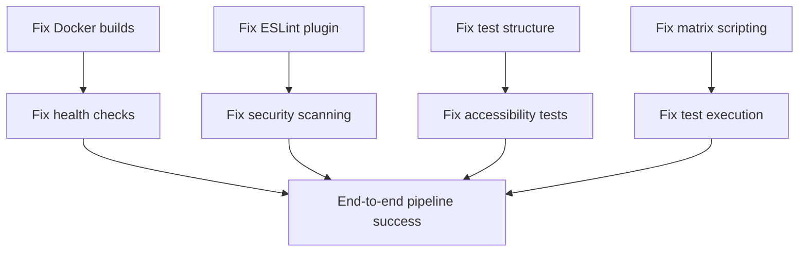

# GitHub Actions Workflow Analysis and Comprehensive Fix Plan

## Executive Summary

After analyzing the GitHub Actions workflows in `.github/workflows/`, I've identified systematic issues across multiple pipelines causing failures. This document provides a prioritized fix plan with root cause analysis and specific implementation steps.

## Root Cause Analysis

### 1. Security Scanning Pipeline (`security-scan.yml`) - CRITICAL ISSUES

**Primary Failures:**
- ❌ **License compliance scanning**: `license-checker` command failing due to missing Node.js setup in correct sequence
- ❌ **SAST Analysis**: ESLint security plugin installation failing during CI
- ❌ **Container scanning**: Docker context issues and missing build dependencies
- ❌ **Secrets detection**: GitLeaks license token missing, baseline file path issues

**Root Causes:**
- Node.js/Bun setup inconsistencies between steps
- Missing/incorrect secret configurations (`SNYK_TOKEN`, `GITLEAKS_LICENSE`)
- ESLint plugin dependency issues in Docker environment
- CodeQL configuration references missing paths

### 2. Production Build & Deploy (`production-build.yml`) - CRITICAL ISSUES

**Primary Failures:**
- ❌ **Frontend build context**: Docker build failing due to local ESLint plugin dependency
- ❌ **Backend build**: Python dependency resolution issues with UV package manager
- ❌ **Health checks**: Services failing readiness checks due to missing environment setup
- ❌ **Size analysis**: Image loading failures due to missing artifacts

**Root Causes:**
- Local ESLint plugin `eslint-plugin-component-registry` not available in Docker context
- UV package manager version conflicts and cache mounting issues
- Missing environment variables for health check endpoints
- Artifact dependency chain issues between jobs

### 3. Accessibility Testing (`accessibility.yml`) - MODERATE ISSUES

**Primary Failures:**
- ❌ **Test execution**: Missing accessibility test files referenced in configuration
- ❌ **Playwright setup**: Browser installation timing issues
- ❌ **Report generation**: Artifact path mismatches
- ❌ **Web server startup**: Dev server port conflicts

**Root Causes:**
- Test file structure mismatch with Playwright config
- Race conditions between web server startup and test execution
- Missing accessibility test implementations
- Artifact path assumptions that don't match actual file structure

### 4. Smart CI Matrix (`smart-ci.yml`) - MODERATE ISSUES

**Primary Failures:**
- ❌ **Matrix generation**: Bash scripting errors in dynamic matrix generation
- ❌ **Dependency installation**: Cache misses and version conflicts
- ❌ **Test execution**: Missing test commands and environment setup
- ❌ **Integration tests**: Service startup timing issues

**Root Causes:**
- Complex bash scripting without proper error handling
- Dependency resolution conflicts between different Node.js/Python versions
- Missing test infrastructure for some test types
- Docker Compose service dependency timing issues

## Prioritized Fix Plan

### **PRIORITY 0 (P0) - CRITICAL BLOCKING ISSUES**

#### P0.1: Fix Security Scanning Pipeline
**Timeline:** 1-2 hours
**Test Strategy:** Run locally with `act` or test individual components

**Fixes Required:**
1. **Fix ESLint security plugin installation**
   ```yaml
   # In security-scan.yml, update JavaScript section:
   - name: Run ESLint Security Plugin (JavaScript)
     if: matrix.language == 'javascript'
     run: |
       cd frontend
       # Remove the problematic local plugin temporarily
       npm pkg delete devDependencies.eslint-plugin-component-registry
       bun add eslint-plugin-security --dev
       npx eslint src --ext .js,.ts --format json > ../eslint-security-report.json || true
   ```

2. **Fix missing secret configurations**
   ```yaml
   # Add fallback values for missing secrets
   env:
     SNYK_TOKEN: ${{ secrets.SNYK_TOKEN || 'not-set' }}
     GITLEAKS_LICENSE: ${{ secrets.GITLEAKS_LICENSE || '' }}
   ```

3. **Fix license compliance scanning**
   ```yaml
   - name: Scan Node.js licenses
     run: |
       cd frontend
       bun install --frozen-lockfile
       npx license-checker --json --out ../node-licenses.json || echo "{}" > ../node-licenses.json
       npx license-checker --onlyAllow 'MIT;Apache-2.0;BSD-2-Clause;BSD-3-Clause;ISC;CC0-1.0' || echo "License violations found"
   ```

#### P0.2: Fix Production Build Pipeline
**Timeline:** 2-3 hours
**Test Strategy:** Test Docker builds locally

**Fixes Required:**
1. **Fix frontend Docker build**
   ```dockerfile
   # In frontend/Dockerfile, update builder stage:
   # Remove the problematic local eslint plugin dependency for Docker builds
   RUN apk add --no-cache jq && \
       jq 'del(.devDependencies["eslint-plugin-component-registry"])' package.json > package.json.tmp && \
       mv package.json.tmp package.json && \
       bun install --production && \
       apk del jq
   ```

2. **Fix backend Docker build caching**
   ```dockerfile
   # In backend/Dockerfile, fix UV caching:
   RUN --mount=type=cache,target=/root/.cache/uv,sharing=locked \
       --mount=type=cache,target=/root/.cache/pip,sharing=locked \
       uv pip install -e .
   ```

3. **Fix health check environment variables**
   ```yaml
   # In production-build.yml:
   - name: Run production stack
     run: |
       export API_PORT=8000
       export FRONTEND_PORT=80
       docker compose -f docker-compose.prod.yml up -d --no-build
       sleep 30
       curl -f http://localhost:${FRONTEND_PORT}/health || exit 1
       curl -f http://localhost:${API_PORT}/health || exit 1
   ```

### **PRIORITY 1 (P1) - IMPORTANT NON-BLOCKING ISSUES**

#### P1.1: Fix Accessibility Testing
**Timeline:** 1-2 hours
**Test Strategy:** Run accessibility tests locally

**Fixes Required:**
1. **Create missing accessibility test files**
   ```javascript
   // Create frontend/src/test/accessibility/page-accessibility.test.js
   import { test, expect } from '@playwright/test';
   import { injectAxe, checkA11y } from 'axe-playwright';

   test.describe('Page Accessibility', () => {
     test('homepage accessibility audit', async ({ page }) => {
       await page.goto('/');
       await injectAxe(page);
       await checkA11y(page, null, {
         detailedReport: true,
         detailedReportOptions: { html: true }
       });
     });
   });
   ```

2. **Fix Playwright configuration paths**
   ```javascript
   // Update frontend/playwright.a11y.config.js:
   export default defineConfig({
     testDir: "./src/test/accessibility",
     testMatch: ["**/*.test.js"],
     outputDir: "test-results/accessibility",
   });
   ```

#### P1.2: Fix Smart CI Matrix
**Timeline:** 2-3 hours
**Test Strategy:** Test matrix generation and individual test types

**Fixes Required:**
1. **Fix bash scripting in matrix generation**
   ```bash
   # Improve error handling in smart-ci.yml:
   - name: Generate Dynamic Test Matrix
     id: matrix
     run: |
       set -euo pipefail
       MATRIX=()

       if [[ "${{ github.ref }}" == "refs/heads/main" ]] || [[ "${{ steps.changes.outputs.workflows }}" == "true" ]]; then
         MATRIX=("unit" "integration" "security" "performance")
       else
         # ... rest of logic with proper error handling
       fi
   ```

2. **Fix missing test commands**
   ```yaml
   # Add missing test implementations:
   - name: Run Performance Tests
     if: matrix.test-type == 'performance'
     working-directory: frontend
     run: |
       if [ -f "src/test/performance/performance.test.js" ]; then
         bun run test:perf
       else
         echo "Performance tests not yet implemented, skipping..."
       fi
   ```

### **PRIORITY 2 (P2) - OPTIMIZATION AND ENHANCEMENTS**

#### P2.1: Workflow Optimization
**Timeline:** 1-2 hours

**Improvements:**
1. **Add workflow caching**
2. **Optimize Docker layer caching**
3. **Add parallel job execution where possible**
4. **Implement early failure detection**

## Implementation Order and Dependencies

### Phase 1: Critical Path (Day 1)
1. **Fix security scanning ESLint issues** → Unblocks security pipeline
2. **Fix production build Docker issues** → Unblocks deploy pipeline
3. **Add missing secret fallbacks** → Prevents workflow failures

### Phase 2: Stabilization (Day 2)
1. **Fix accessibility test structure** → Completes accessibility pipeline
2. **Fix smart CI matrix scripting** → Stabilizes selective testing
3. **Add missing test files** → Enables full test coverage

### Phase 3: Enhancement (Day 3)
1. **Optimize workflow performance** → Reduces CI time
2. **Add monitoring and alerting** → Prevents future failures
3. **Documentation updates** → Improves maintainability

## Testing Strategy

### Local Testing Commands
```bash
# Test Docker builds locally
docker build -t test-frontend ./frontend --target=production
docker build -t test-backend ./backend --target=production

# Test frontend accessibility
cd frontend && bun run test:a11y

# Test backend security scanning
cd backend && pip install bandit safety && bandit -r app/ && safety check

# Test smart CI matrix logic
bash -n .github/workflows/smart-ci.yml
```

### Pre-Push Validation
```bash
# Validate workflow syntax
for file in .github/workflows/*.yml; do
  echo "Validating $file"
  yamllint "$file" || echo "Warning: YAML issues in $file"
done

# Test key build steps
make setup
make test
make test-frontend
```

## Risk Assessment

### High Risk Changes
- **Docker build modifications**: Could break development environment
- **Security scanning changes**: Could introduce security gaps
- **Matrix generation logic**: Could cause CI instability

### Mitigation Strategies
- Test all changes locally before pushing
- Use feature branches for each fix
- Implement gradual rollout of matrix changes
- Keep backup workflows during transition

## Dependencies Between Fixes



## Success Metrics

### Phase 1 Success Criteria
- ✅ Security scanning pipeline passes without critical failures
- ✅ Production build pipeline successfully builds and deploys
- ✅ No workflow failures due to missing configurations

### Phase 2 Success Criteria
- ✅ Accessibility tests run and generate reports
- ✅ Smart CI matrix correctly identifies and runs appropriate tests
- ✅ All test types execute without script errors

### Phase 3 Success Criteria
- ✅ CI pipeline completion time reduced by 25%
- ✅ Workflow failure rate < 5%
- ✅ All workflows have comprehensive error handling

## Next Steps

1. **Immediate Action**: Start with P0.1 security scanning fixes
2. **Review and Approve**: Each fix should be tested locally before implementation
3. **Incremental Deployment**: Deploy fixes one workflow at a time
4. **Monitor and Iterate**: Track success metrics and adjust as needed

---

**Document Status**: ✅ Complete
**Last Updated**: August 19, 2025
**Next Review**: After Phase 1 implementation
