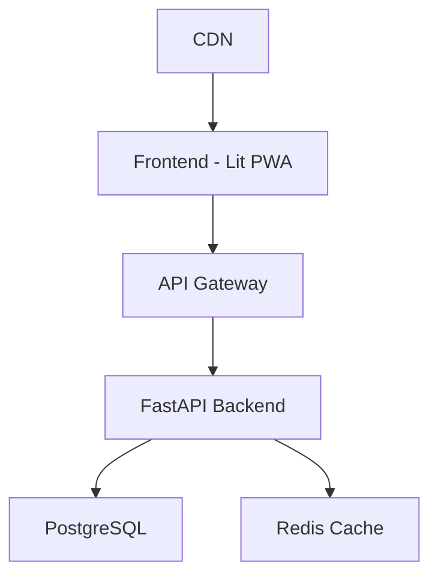
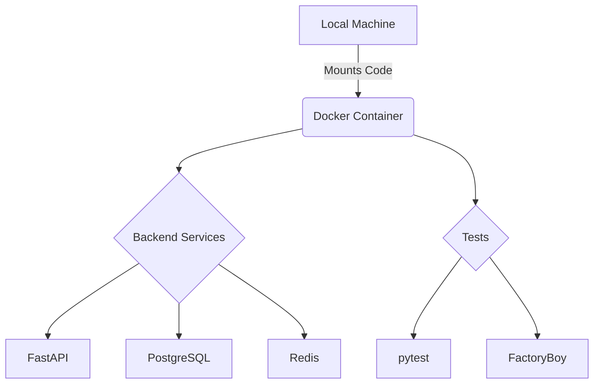

# NeoForge Architecture Documentation

## Table of Contents

- [Architecture Overview](#architecture-overview)
- [Key Technical Decisions](#key-technical-decisions)
- [Component Architecture](#component-architecture)
- [Data Flow](#data-flow)
- [Scaling Considerations](#scaling-considerations)
- [Security Architecture](#security-architecture)
- [Cost Optimization](#cost-optimization)

## Architecture Overview

### High-Level Architecture



### Key Components

1. **Frontend Layer**
   - Lit 4.0 Web Components
   - PWA with offline capabilities
   - CDN-friendly architecture

2. **Backend Layer**
   - FastAPI with async support
   - SQLModel for type-safe ORM
   - Redis for caching/rate limiting

3. **Data Layer**
   - PostgreSQL (with async drivers)
   - Migration management
   - Backup strategies

## Key Technical Decisions

### 1. Frontend Framework Selection

**Choice: Lit 4.0**

- ✅ **Pros**:
  - Tiny runtime (4KB)
  - Native web components
  - Browser-native features
  - Excellent SEO capabilities
- ❌ **Cons**:
  - Smaller ecosystem than React
  - Fewer ready-made components
  - Learning curve for team

**Founder Impact**: Lower bundle sizes mean faster load times and better user experience, leading to higher conversion rates.

### 2. Backend Framework Selection

**Choice: FastAPI**

- ✅ **Pros**:
  - Fast development speed
  - Automatic API documentation
  - Type safety with Pydantic
  - Easy async/await support
- ❌ **Cons**:
  - Fewer enterprise patterns
  - Some async complexity
  - Limited middleware ecosystem

**Founder Impact**: Faster development cycles mean quicker iterations on your MVP.

### 3. Database Selection

**Choice: PostgreSQL + SQLModel**

- ✅ **Pros**:
  - Free tier available on many providers
  - Rich feature set
  - Type safety with SQLModel
  - Easy scaling options
- ❌ **Cons**:
  - More complex than SQLite
  - Needs connection management
  - Requires proper indexing

**Founder Impact**: Start with minimal costs, scale when needed without migration pain.

## Component Architecture

### Frontend Components

```typescript
// Example of a Lit component with optimization
@customElement('user-card')
export class UserCard extends LitElement {
  @property({ type: Object }) user!: User;
  
  // Optimize re-renders
  protected shouldUpdate(changedProps: Map<string, any>) {
    return changedProps.has('user');
  }

  render() {
    return html`
      <div class="card">
        <h2>${this.user.name}</h2>
        <p>${this.user.email}</p>
      </div>
    `;
  }
}
```

### Backend Services

```python
# Example of a cost-optimized service
from fastapi import FastAPI, Depends, HTTPException
from redis import asyncio as aioredis

class CostOptimizedService:
    def __init__(self, redis: aioredis.Redis = Depends(get_redis)):
        self.redis = redis
        self.cache_ttl = 3600  # 1 hour

    async def get_user_data(self, user_id: int):
        # Try cache first
        cache_key = f"user:{user_id}"
        if cached := await self.redis.get(cache_key):
            return json.loads(cached)
            
        # Fallback to database
        user = await self.db.get_user(user_id)
        await self.redis.set(cache_key, json.dumps(user), ex=self.cache_ttl)
        return user
```

## Data Flow

### Request Lifecycle

1. **Client Request**

   ```mermaid
   sequenceDiagram
       Client->>+CDN: Request Asset
       CDN-->>-Client: Cached Response
       Client->>+API: Request Data
       API->>+Cache: Check Cache
       Cache-->>-API: Cache Hit/Miss
       API->>+DB: If Cache Miss
       DB-->>-API: DB Response
       API-->>-Client: Final Response
   ```

2. **Caching Strategy**
   - Browser-level caching
   - CDN caching for static assets
   - Redis caching for API responses
   - Optimized for cost/performance ratio

## Scaling Considerations

### 1. Development Phase

```yaml
# docker-compose.dev.yml
services:
  api:
    build: ./backend
    volumes:
      - ./backend:/app
  db:
    image: postgres:14-alpine
    volumes:
      - postgres_data:/var/lib/postgresql/data
```

### 2. MVP Phase

```yaml
# docker-compose.prod.yml
services:
  api:
    image: neoforge/api:${VERSION}
    deploy:
      replicas: 2
  db:
    image: postgres:14-alpine
    volumes:
      - postgres_data:/var/lib/postgresql/data
```

### 3. Growth Phase

- Kubernetes configurations available
- Auto-scaling policies
- Global CDN integration

## Security Architecture

### 1. Authentication Flow

```python
# backend/core/security.py
from fastapi_security import OAuth2PasswordBearer
from jose import JWTError, jwt

class SecurityService:
    async def authenticate_user(self, token: str) -> User:
        try:
            payload = jwt.decode(token, settings.SECRET_KEY)
            return await self.user_service.get_user(payload["sub"])
        except JWTError:
            raise HTTPException(status_code=401)
```

### 2. Security Measures

- HTTPS everywhere
- CORS configuration
- Rate limiting
- Input validation
- SQL injection protection
- XSS prevention

## Cost Optimization

### 1. Development Environment

- Local Docker setup
- SQLite for development
- Minimal cloud usage

### 2. Production Optimization

```python
# Example of cost-optimized caching
class CacheConfig:
    CACHE_TTL = {
        "high_change": 300,    # 5 minutes
        "medium_change": 3600, # 1 hour
        "low_change": 86400    # 1 day
    }
```

### Monthly Cost Breakdown

| Component | Dev Cost | MVP Cost | Growth Cost |
|-----------|----------|-----------|-------------|
| Hosting   | $0       | $5        | $20+        |
| Database  | $0       | $7        | $50+        |
| Cache     | $0       | $5        | $30+        |
| CDN       | $0       | $0        | $10+        |
| **Total** | **$0**   | **$17**   | **$110+**   |

## Performance Optimization

### 1. Frontend Optimization

```typescript
// Example of performance-optimized Lit component
@customElement('data-table')
export class DataTable extends LitElement {
  // Use virtual scrolling for large datasets
  @property({ type: Array }) data!: any[];
  
  // Implement intersection observer for lazy loading
  firstUpdated() {
    const observer = new IntersectionObserver(
      (entries) => {
        entries.forEach(entry => {
          if (entry.isIntersecting) {
            this.loadMoreData();
          }
        });
      }
    );
  }
}
```

### 2. Backend Optimization

```python
# Example of optimized database queries
async def get_user_data(self, user_id: int):
    query = select(User).options(
        selectinload(User.preferences),  # Eager load related data
        selectinload(User.settings)
    ).where(User.id == user_id)
    
    return await self.db.execute(query)
```

## Monitoring and Observability

### 1. Key Metrics

- Response times
- Error rates
- Resource usage
- Cost per request
- User engagement

### 2. Implementation

```python
# Example of cost-aware monitoring
from opentelemetry import trace
from prometheus_client import Counter

requests_counter = Counter('api_requests_total', 'Total API requests')

@app.middleware("http")
async def monitor_requests(request: Request, call_next):
    requests_counter.inc()
    # Add cost tracking
    start_time = time.time()
    response = await call_next(request)
    duration = time.time() - start_time
    
    # Log if expensive request
    if duration > 1.0:  # More than 1 second
        logger.warning(f"Expensive request: {request.url}")
    
    return response
```

---

This architecture is designed to provide a solid foundation for bootstrapped founders while maintaining flexibility for future growth. The focus is on:

1. **Minimal Initial Costs**: Start with basic infrastructure
2. **Quick Development**: Rapid MVP iteration
3. **Scale Ready**: Easy path to growth
4. **Security First**: Protected by default
5. **Performance Focused**: Optimized for conversion

Remember: This architecture can be implemented incrementally. Start with the basics and add complexity only when needed.

### Development Environment Updates


```yaml:backend/docker-compose.dev.yml
version: '3.8'

services:
  backend:
    build: 
      context: .
      dockerfile: Dockerfile.dev
    ports:
      - "8000:8000"
    volumes:
      - .:/app
    environment:
      - ENVIRONMENT=development
    depends_on:
      postgres:
        condition: service_healthy
      redis:
        condition: service_healthy

  postgres:
    image: postgres:15-alpine
    healthcheck:
      test: ["CMD-SHELL", "pg_isready -U app"]
      interval: 5s
      timeout: 5s
      retries: 5
    environment:
      POSTGRES_USER: app
      POSTGRES_PASSWORD: app
      POSTGRES_DB: app
    volumes:
      - postgres_data:/var/lib/postgresql/data

  redis:
    image: redis:7-alpine
    healthcheck:
      test: ["CMD", "redis-cli", "ping"]
      interval: 5s
      timeout: 5s
      retries: 5

volumes:
  postgres_data:
```
