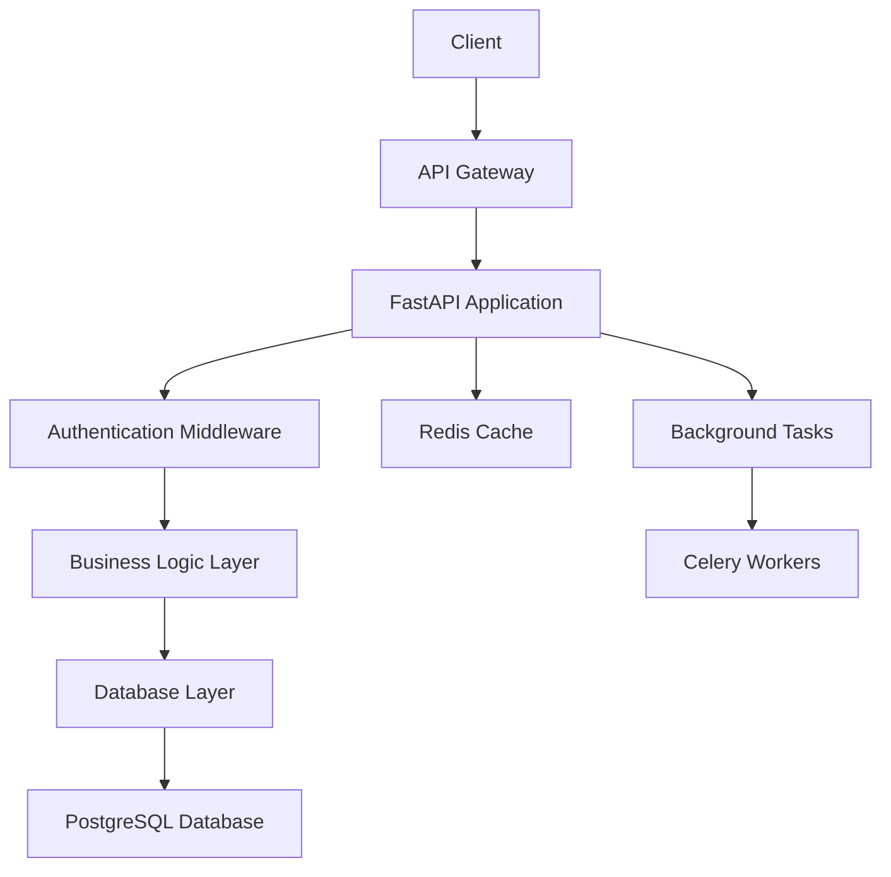
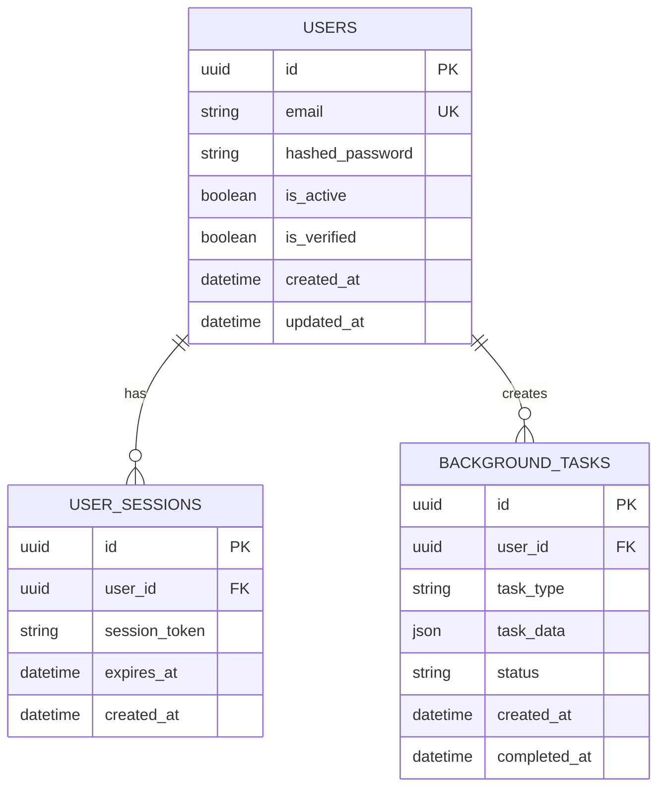

# Backend Development Guide

## Architecture Overview



## API Endpoints

### Authentication
- `POST /api/v1/auth/register` - User registration
- `POST /api/v1/auth/login` - User login
- `POST /api/v1/auth/refresh` - Token refresh
- `POST /api/v1/auth/logout` - User logout

### Users
- `GET /api/v1/users/me` - Get current user profile
- `PUT /api/v1/users/me` - Update user profile
- `DELETE /api/v1/users/me` - Delete user account

### Core Features
- `GET /api/v1/health` - Health check endpoint
- `GET /api/v1/config` - Dynamic configuration
- `GET /api/v1/metrics` - Prometheus metrics

## Database Schema



## Development Workflow

### Database Operations

```bash
# Run migrations
docker compose run --rm api alembic upgrade head

# Create new migration
docker compose run --rm api alembic revision --autogenerate -m "description"

# Rollback migration
docker compose run --rm api alembic downgrade -1

# Reset database (development only)
docker compose down -v
make dev
```

### Testing

```bash
# Run all tests
docker compose run --rm api_test pytest

# Run with coverage
docker compose run --rm api_test pytest --cov --cov-report=html

# Run specific test
docker compose run --rm api_test pytest tests/api/test_auth.py::test_login -v

# Run integration tests
docker compose run --rm api_test pytest tests/integration/ -v
```

### Code Quality

```bash
# Lint code
ruff check backend/

# Format code
ruff format backend/

# Type checking
mypy backend/app/
```

## API Development Patterns

### Endpoint Structure
```python
from fastapi import APIRouter, Depends, HTTPException
from sqlmodel.ext.asyncio.session import AsyncSession
from app.api.deps import get_current_user, get_db
from app.schemas.users import UserResponse, UserUpdate
from app.crud import user

router = APIRouter()

@router.get("/me", response_model=UserResponse)
async def get_current_user_profile(
    db: AsyncSession = Depends(get_db),
    current_user: User = Depends(get_current_user)
):
    return current_user

@router.put("/me", response_model=UserResponse)
async def update_user_profile(
    user_update: UserUpdate,
    db: AsyncSession = Depends(get_db),
    current_user: User = Depends(get_current_user)
):
    return await user.update(db, db_obj=current_user, obj_in=user_update)
```

### Database Operations (CRUD)
```python
from sqlmodel.ext.asyncio.session import AsyncSession
from sqlmodel import select
from app.models.user import User
from app.schemas.users import UserCreate, UserUpdate

class UserCRUD:
    async def get_by_email(self, db: AsyncSession, email: str) -> User | None:
        statement = select(User).where(User.email == email)
        result = await db.exec(statement)
        return result.first()

    async def create(self, db: AsyncSession, obj_in: UserCreate) -> User:
        db_obj = User.model_validate(obj_in)
        db.add(db_obj)
        await db.commit()
        await db.refresh(db_obj)
        return db_obj

user = UserCRUD()
```

### Background Tasks
```python
from app.worker.celery import celery_app
from app.core.email import send_verification_email

@celery_app.task
def send_welcome_email(user_id: str, email: str):
    """Send welcome email to new user"""
    try:
        send_verification_email(email, user_id)
        return {"status": "success", "user_id": user_id}
    except Exception as e:
        return {"status": "error", "error": str(e)}

# Usage in API endpoint
@router.post("/register")
async def register_user(user_create: UserCreate, db: AsyncSession = Depends(get_db)):
    user = await user_crud.create(db, obj_in=user_create)
    send_welcome_email.delay(str(user.id), user.email)
    return user
```

## Database Migration Guide

### SQLite → PostgreSQL Migration

For local development transitioning to production:

```bash
# 1. Export SQLite data
sqlite3 app.db .dump > sqlite_dump.sql

# 2. Clean up SQLite-specific syntax
sed 's/BEGIN TRANSACTION;/BEGIN;/g' sqlite_dump.sql > postgres_dump.sql

# 3. Import to PostgreSQL
docker compose -f backend/docker-compose.dev.yml exec postgres psql -U neoforge -d neoforge -f postgres_dump.sql
```

### Schema Evolution Best Practices

1. **Always review auto-generated migrations**
2. **Test migrations on copy of production data**
3. **Create rollback plan for breaking changes**
4. **Use proper indexing for performance**

```python
# Example migration with proper indexing
def upgrade() -> None:
    op.create_table('users',
        sa.Column('id', sa.UUID(), nullable=False),
        sa.Column('email', sa.String(255), nullable=False),
        sa.Column('created_at', sa.DateTime(), nullable=False),
        sa.PrimaryKeyConstraint('id'),
        sa.UniqueConstraint('email')
    )
    # Add index for common queries
    op.create_index('ix_users_email', 'users', ['email'])
    op.create_index('ix_users_created_at', 'users', ['created_at'])
```

## Performance Optimization

### Database Query Optimization
```python
# Use select with specific columns
statement = select(User.id, User.email).where(User.is_active == True)

# Use joins instead of multiple queries
statement = select(User).join(UserSession).where(UserSession.expires_at > datetime.utcnow())

# Use pagination for large datasets
statement = select(User).offset(skip).limit(limit)
```

### Caching with Redis
```python
import json
from app.core.redis import redis_client

async def get_user_cache(user_id: str) -> dict | None:
    cached = await redis_client.get(f"user:{user_id}")
    return json.loads(cached) if cached else None

async def set_user_cache(user_id: str, user_data: dict, expire: int = 3600):
    await redis_client.setex(f"user:{user_id}", expire, json.dumps(user_data))
```

## Security Best Practices

1. **Input Validation**: All inputs validated through Pydantic schemas
2. **SQL Injection Prevention**: SQLModel parameterized queries only
3. **Authentication**: JWT tokens with proper expiration
4. **Authorization**: Role-based access control
5. **Rate Limiting**: Per-client IP limits configured
6. **HTTPS Only**: All production traffic encrypted

## Monitoring & Observability

### Health Checks
```python
@router.get("/health")
async def health_check():
    return {
        "status": "healthy",
        "timestamp": datetime.utcnow(),
        "version": "1.0.0"
    }
```

### Metrics Collection
```python
from prometheus_client import Counter, Histogram
from app.core.metrics import REQUEST_COUNT, REQUEST_DURATION

@router.post("/api/v1/users")
async def create_user():
    REQUEST_COUNT.labels(method="POST", endpoint="/users").inc()
    with REQUEST_DURATION.labels(method="POST", endpoint="/users").time():
        # API logic here
        pass
```

### Structured Logging
```python
import structlog
from app.core.config import settings

logger = structlog.get_logger(__name__)

@router.post("/login")
async def login(user_credentials: UserLogin):
    logger.info("User login attempt", email=user_credentials.email, ip=request.client.host)
    # Login logic
    logger.info("User login successful", user_id=user.id, email=user.email)
```

## Common Development Tasks

### Adding New Model
1. Create model in `app/models/`
2. Create schemas in `app/schemas/`
3. Create CRUD operations in `app/crud/`
4. Generate migration: `alembic revision --autogenerate -m "add new model"`
5. Add API endpoints in `app/api/endpoints/`
6. Write comprehensive tests

### Background Task Implementation
1. Define task in `app/worker/tasks/`
2. Register with Celery app
3. Add task invocation in API endpoints
4. Monitor task execution with Flower
5. Handle task failures gracefully

### API Versioning
```python
# app/api/v2/api.py
from fastapi import APIRouter
from app.api.v2.endpoints import users as users_v2

api_router = APIRouter(prefix="/v2")
api_router.include_router(users_v2.router, prefix="/users", tags=["users-v2"])
```