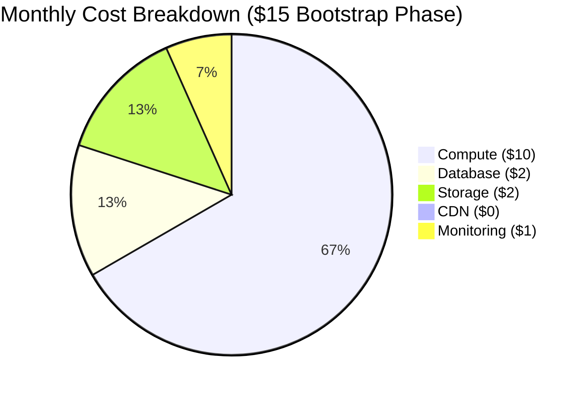

# 💸 Cost Optimization Guide

Real-world cost breakdown and optimization strategies for bootstrapped founders.

## Monthly Cost Breakdown



## Infrastructure Costs

### Bootstrap Phase ($15/month)

| Component | Specification | Cost |
|-----------|--------------|------|
| DO Droplet | 1GB RAM, 1vCPU | $10 |
| PostgreSQL | Co-hosted, 10GB | $0 |
| Volume Storage | 20GB SSD | $2 |
| Backups | Daily snapshots | $2 |
| CDN | Cloudflare Free | $0 |
| Monitoring | Basic metrics | $1 |

### Growth Phase ($50-100/month)

| Component | Specification | Cost |
|-----------|--------------|------|
| DO Droplets | 2x 2GB RAM | $30 |
| PostgreSQL | Managed DB | $15 |
| Storage | 50GB SSD | $5 |
| Backups | Automated | $5 |
| CDN | Cloudflare Free | $0 |
| Monitoring | Full stack | $10 |

## Cost Control Strategies

### 1. Compute Optimization

```hcl
# Nomad job resource limits
task "api" {
  resources {
    cpu    = 200  # 0.2 CPU
    memory = 256  # 256MB RAM
  }
}
```

### 2. Database Optimization

```python
# Efficient query patterns
async def get_users(limit: int = 100):
    query = select(User).limit(limit)
    return await db.execute(query)

# Connection pooling
engine = create_engine(
    settings.DATABASE_URL,
    pool_size=5,
    max_overflow=10
)
```

### 3. Storage Optimization

- Regular cleanup of old data
- Compression for logs
- CDN caching for static assets

### 4. Monitoring Costs

- Basic metrics in bootstrap phase
- Custom metrics when needed
- Log rotation and compression

## Scaling Thresholds

### When to Scale Up

- CPU consistently > 70%
- Memory usage > 80%
- Database connections > 80%
- Response times > 200ms

### Cost-Effective Scaling Steps

1. **Optimize Current Resources**

   ```bash
   # Monitor resource usage
   make monitor-resources

   # Identify bottlenecks
   make analyze-performance
   ```

2. **Vertical Scaling**

   ```bash
   # Upgrade droplet
   terraform apply -var="droplet_size=s-2vcpu-2gb"
   ```

3. **Horizontal Scaling**

   ```bash
   # Add another node
   terraform apply -var="node_count=2"
   ```

## Cost Monitoring

### 1. Budget Alerts

```hcl
# terraform/monitoring.tf
resource "datadog_monitor" "cost_alert" {
  name    = "Cost Alert"
  type    = "metric alert"
  query   = "avg:system.disk_usage.used{*} > 80"
  message = "Resource usage approaching threshold"
}
```

### 2. Resource Tracking

```bash
# Track daily costs
make costs

# Sample output:
# Daily Cost Breakdown:
# - Compute: $0.33
# - Storage: $0.07
# - Database: $0.07
# Total: $0.47
```

## Optimization Checklist

### Daily Checks

- [ ] Monitor resource usage
- [ ] Review error logs
- [ ] Check database metrics
- [ ] Verify backup status

### Weekly Checks

- [ ] Analyze cost trends
- [ ] Review unused resources
- [ ] Check scaling metrics
- [ ] Verify backup costs

### Monthly Checks

- [ ] Full cost analysis
- [ ] Resource optimization
- [ ] Performance review
- [ ] Scaling assessment

## Cost Reduction Strategies

### 1. Development Environment

```bash
# Use local resources
docker-compose up

# Minimize cloud usage
make dev-local
```

### 2. Production Optimization

```yaml
# docker-compose.prod.yml
services:
  api:
    image: neoforge/api:latest
    deploy:
      resources:
        limits:
          cpus: '0.2'
          memory: 256M
```

### 3. Database Optimization

- Use connection pooling
- Implement query caching
- Regular maintenance
- Optimize indexes

### 4. Storage Optimization

- Implement TTL for logs
- Use compression
- CDN for static assets
- Regular cleanup

## Cost-Aware Development

### 1. Local Development

- Use local PostgreSQL
- Minimize cloud resources
- Efficient testing strategy

### 2. CI/CD Optimization

```yaml
# .github/workflows/ci.yml
jobs:
  test:
    runs-on: ubuntu-latest
    timeout-minutes: 10  # Limit CI minutes
```

### 3. Testing Strategy

- Use test containers
- Efficient test data
- Parallel testing
- Cache test results

Remember:

1. Start minimal
2. Monitor constantly
3. Optimize early
4. Scale gradually
5. Review regularly
