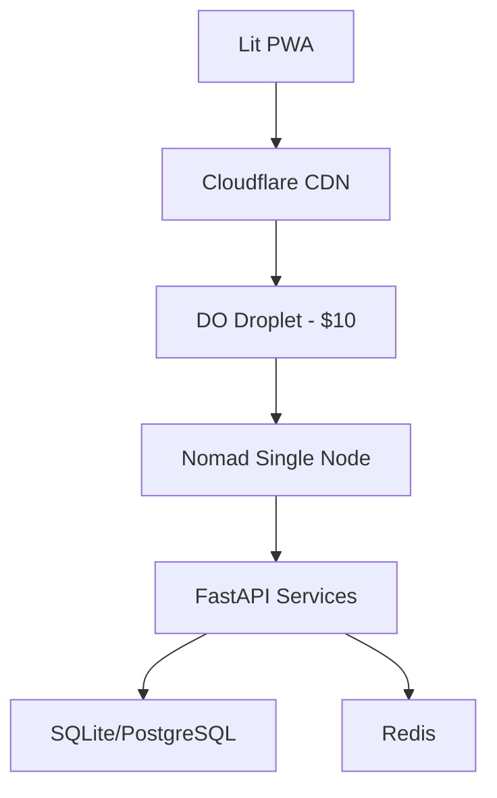

# NeoForge Ultra-Lean Deployment Guide

## Overview

### Modern Stack

- **Backend**: FastAPI + UV + Ruff
- **Frontend**: Lit + Web Components
- **Infrastructure**: Nomad + DO + Terraform
- **Cost Target**: $10-15/month initial phase

### Architecture Diagram



## Infrastructure Setup (Bootstrap Mode)

### 1. Single Droplet Setup ($10)

```hcl
# terraform/bootstrap.tf
resource "digitalocean_droplet" "nomad_server" {
  name      = "nomad-bootstrap"
  size      = "s-1vcpu-1gb"  # $10 droplet
  image     = "ubuntu-22-04-x64"
  region    = "nyc3"
  user_data = templatefile("${path.module}/scripts/nomad-bootstrap.sh", {
    NOMAD_VERSION = "1.6.1"
  })
}

# DNS for your domain
resource "cloudflare_record" "app" {
  zone_id = var.cloudflare_zone_id
  name    = "app"
  value   = digitalocean_droplet.nomad_server.ipv4_address
  type    = "A"
  proxied = true  # Free Cloudflare CDN
}
```

### 2. Bootstrap Nomad Configuration

```hcl
# nomad/bootstrap.hcl
datacenter = "nyc3"
data_dir   = "/opt/nomad/data"

# Single node setup
server {
  enabled          = true
  bootstrap_expect = 1  # Single node mode
}

client {
  enabled = true
  options {
    "docker.cleanup.image"   = false
    "driver.raw_exec.enable" = "1"
  }
}
```

### 3. Resource-Optimized Services

```hcl
job "api" {
  datacenters = ["nyc3"]

  group "api" {
    count = 1  # Single instance for bootstrap

    task "api" {
      driver = "docker"

      config {
        image = "neoforge/api:latest"
      }

      resources {
        cpu    = 200  # 0.2 CPU
        memory = 256  # 256MB RAM
      }
    }
  }
}
```

## Modern Development Setup

### Backend Development

```bash
# Use UV for faster dependency management
curl -LsSf https://astral.sh/uv/install.sh | sh
uv venv
uv pip install -r requirements.txt

# Configure Ruff
cat > pyproject.toml << EOF
[tool.ruff]
select = ["ALL"]
ignore = ["D203", "D212"]
line-length = 120

[tool.ruff.lint]
fixable = ["ALL"]
unfixable = ["F"]

[tool.ruff.format]
quote-style = "double"
indent-style = "space"
skip-magic-trailing-comma = false
EOF
```

### Frontend Development

```typescript
// vite.config.js
export default defineConfig({
  build: {
    minify: 'esbuild',
    rollupOptions: {
      output: {
        manualChunks: {
          'lit': ['lit']  // Separate Lit bundle
        }
      }
    }
  }
});
```

## Cost Optimization

### Monthly Cost Breakdown (Bootstrap Phase)

| Component | Specification | Monthly Cost |
|-----------|--------------|--------------|
| DO Droplet | 1GB RAM, 1vCPU | $10 |
| Database | SQLite → Postgres | $0 → $7 |
| CDN | Cloudflare Free | $0 |
| Backups | DO Snapshots | $2 |
| **Total** | | **$12** |

### Scaling Thresholds

- **When to upgrade droplet**:
  - CPU consistently > 70%
  - Memory usage > 80%
  - Response times > 200ms

- **When to add nodes**:
  - Daily active users > 1000
  - Database size > 10GB
  - Peak traffic > 100 req/s

## Monitoring Setup

```hcl
job "monitoring" {
  group "monitoring" {
    task "node_exporter" {
      driver = "docker"
      
      resources {
        cpu    = 100  # 0.1 CPU
        memory = 64   # 64MB RAM
      }
    }
  }
}
```

## Debug-Friendly Setup

### Frontend Debugging

```typescript
// Enable source maps in production
export default defineConfig({
  build: {
    sourcemap: true,
    minify: process.env.NODE_ENV === 'production'
  }
});

// Add debug logging
const DEBUG = localStorage.getItem('DEBUG') === 'true';
const log = DEBUG ? console.log : () => {};
```

### Backend Debugging

```python
# uvicorn with debug settings
if settings.DEBUG:
    uvicorn.run(
        "app.main:app",
        host="0.0.0.0",
        port=8000,
        reload=True,
        reload_dirs=["app"],
        log_level="debug"
    )
```

## GitHub Actions CI/CD

```yaml
name: CI/CD Pipeline

on:
  push:
    branches: [ main ]
  pull_request:
    branches: [ main ]

jobs:
  test:
    runs-on: ubuntu-latest
    steps:
      - uses: actions/checkout@v4
      - uses: actions/setup-python@v4
        with:
          python-version: '3.12'
      
      - name: Install UV
        run: curl -LsSf https://astral.sh/uv/install.sh | sh
      
      - name: Install dependencies
        run: |
          uv venv
          uv pip install -r requirements.txt
      
      - name: Lint with Ruff
        run: ruff check .
      
      - name: Run tests
        run: pytest

  deploy:
    needs: test
    runs-on: ubuntu-latest
    steps:
      - name: Deploy to DO
        run: make deploy-bootstrap
```

Remember:

1. Start with the $10 droplet - it's sufficient for most MVPs
2. Use SQLite initially, migrate to Postgres when needed
3. Leverage Cloudflare's free CDN
4. Monitor resource usage to know when to scale
5. Keep debugging tools enabled but protected
