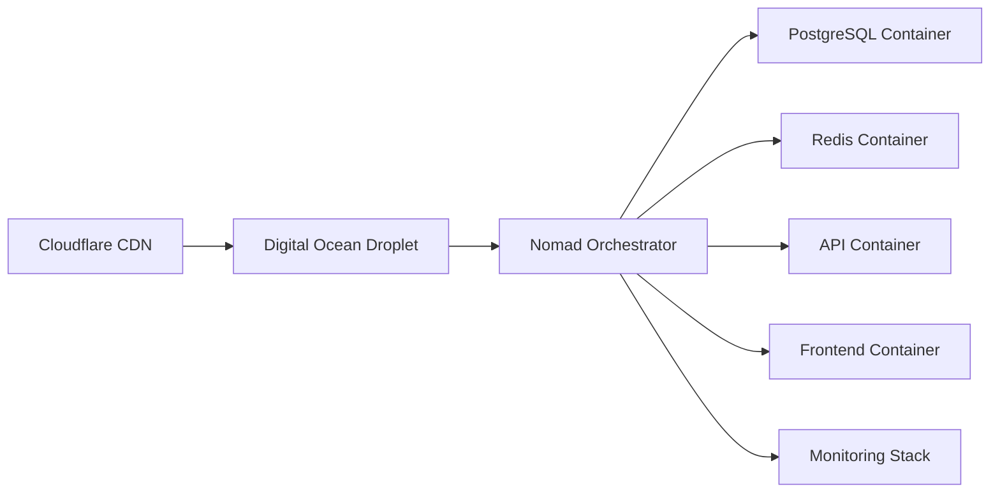

# Infrastructure & Deployment Guide

## Overview

NeoForge is designed for cost-effective deployment on a single Digital Ocean droplet using Docker containers orchestrated by Nomad. This architecture supports rapid MVP development while maintaining a clear scaling path.



## Cost-Optimized Architecture

### Bootstrap Setup ($10/month)
- **Single DO Droplet**: 2GB RAM, 1vCPU, 50GB SSD
- **Nomad + Consul**: Container orchestration
- **PostgreSQL**: Co-hosted database
- **Redis**: Caching and background tasks
- **Cloudflare**: Free tier (DNS, CDN, SSL/TLS)

### Scaling Path
1. **Bootstrap** ($10/month) → Single droplet, co-hosted services
2. **Growth** ($50/month) → Multiple droplets, managed database
3. **Scale** ($200+/month) → Auto-scaling, multi-region, HA setup

## Infrastructure Setup

### 1. Droplet Provisioning

```bash
# Create new droplet
doctl compute droplet create neoforge \
  --size s-2gb \
  --image ubuntu-22-04-x64 \
  --region nyc1

# Configure firewall
ufw allow 22/tcp   # SSH
ufw allow 80/tcp   # HTTP
ufw allow 443/tcp  # HTTPS
ufw allow 4646/tcp # Nomad UI (optional, can be blocked after setup)
ufw enable
```

### 2. Domain & SSL Configuration

```bash
# Add domain to Cloudflare
# 1. Add domain to Cloudflare dashboard
# 2. Update nameservers at domain registrar
# 3. Configure SSL/TLS (Full strict mode)
# 4. Add DNS records:

# A     @       <droplet-ip>
# CNAME www     @
# CNAME api     @
# CNAME admin   @
```

### 3. System Dependencies

```bash
# Update system
apt update && apt upgrade -y

# Install required packages
apt install -y \
  docker.io \
  docker-compose \
  nginx \
  certbot \
  python3-certbot-nginx \
  curl \
  unzip

# Configure docker
systemctl enable docker
systemctl start docker
docker network create neoforge
```

## Container Orchestration Setup

### 1. Nomad Installation

```bash
# Install HashiCorp repository
curl -fsSL https://apt.releases.hashicorp.com/gpg | apt-key add -
apt-add-repository "deb [arch=amd64] https://apt.releases.hashicorp.com $(lsb_release -cs) main"
apt update && apt install nomad consul

# Configure Nomad
cat > /etc/nomad.d/neoforge.hcl <<EOF
datacenter = "dc1"
data_dir = "/opt/nomad/data"
log_level = "INFO"

server {
  enabled = true
  bootstrap_expect = 1
}

client {
  enabled = true
  servers = ["127.0.0.1:4647"]
}

consul {
  address = "127.0.0.1:8500"
}
EOF

# Configure Consul
cat > /etc/consul.d/consul.hcl <<EOF
datacenter = "dc1"
data_dir = "/opt/consul/data"
log_level = "INFO"
server = true
bootstrap_expect = 1
ui_config {
  enabled = true
}
bind_addr = "0.0.0.0"
client_addr = "0.0.0.0"
EOF

# Start services
systemctl enable consul nomad
systemctl start consul nomad
```

### 2. Service Job Definitions

#### PostgreSQL Service
```hcl
# jobs/postgres.hcl
job "postgres" {
  datacenters = ["dc1"]
  type = "service"

  group "postgres" {
    count = 1

    volume "postgres" {
      type      = "host"
      source    = "postgres"
      read_only = false
    }

    task "postgres" {
      driver = "docker"

      config {
        image = "postgres:15-alpine"
        ports = ["postgres"]

        auth {
          username = "neoforge"
          password = "${POSTGRES_PASSWORD}"
        }
      }

      volume_mount {
        volume      = "postgres"
        destination = "/var/lib/postgresql/data"
      }

      resources {
        cpu    = 300 # 0.3 CPU
        memory = 512 # 512MB RAM
      }

      service {
        name = "postgres"
        port = "postgres"

        check {
          name     = "postgres-tcp"
          type     = "tcp"
          interval = "10s"
          timeout  = "2s"
        }

        check {
          name     = "postgres-script"
          type     = "script"
          command  = "pg_isready"
          args     = ["-U", "neoforge", "-d", "neoforge"]
          interval = "30s"
          timeout  = "5s"
        }
      }

      template {
        data = <<EOH
          POSTGRES_USER="neoforge"
          POSTGRES_PASSWORD="${POSTGRES_PASSWORD}"
          POSTGRES_DB="neoforge"
          PGDATA="/var/lib/postgresql/data/pgdata"
        EOH
        destination = "secrets/postgres.env"
        env         = true
      }
    }

    network {
      port "postgres" {
        static = 5432
        to     = 5432
      }
    }
  }
}
```

#### Redis Service
```hcl
# jobs/redis.hcl
job "redis" {
  datacenters = ["dc1"]
  type = "service"

  group "redis" {
    count = 1

    task "redis" {
      driver = "docker"

      config {
        image = "redis:7-alpine"
        ports = ["redis"]
        args = ["redis-server", "--requirepass", "${REDIS_PASSWORD}"]
      }

      resources {
        cpu    = 100 # 0.1 CPU
        memory = 128 # 128MB RAM
      }

      service {
        name = "redis"
        port = "redis"

        check {
          type     = "tcp"
          interval = "10s"
          timeout  = "2s"
        }
      }

      template {
        data = <<EOH
          REDIS_PASSWORD="${REDIS_PASSWORD}"
        EOH
        destination = "secrets/redis.env"
        env         = true
      }
    }

    network {
      port "redis" {
        static = 6379
        to     = 6379
      }
    }
  }
}
```

#### API Service
```hcl
# jobs/api.hcl
job "api" {
  datacenters = ["dc1"]
  type = "service"

  group "api" {
    count = 1

    task "api" {
      driver = "docker"

      config {
        image = "neoforge/api:latest"
        ports = ["http"]
      }

      resources {
        cpu    = 500  # 0.5 CPU
        memory = 1024 # 1GB RAM
      }

      service {
        name = "api"
        port = "http"

        check {
          name     = "api-health"
          type     = "http"
          path     = "/health"
          interval = "10s"
          timeout  = "2s"
        }
      }

      template {
        data = <<EOH
          DATABASE_URL="postgresql://neoforge:${POSTGRES_PASSWORD}@{{ range service "postgres" }}{{ .Address }}:{{ .Port }}{{ end }}/neoforge"
          REDIS_URL="redis://:${REDIS_PASSWORD}@{{ range service "redis" }}{{ .Address }}:{{ .Port }}{{ end }}/0"
          JWT_SECRET="${JWT_SECRET}"
          ENVIRONMENT="production"
        EOH
        destination = "secrets/api.env"
        env         = true
      }
    }

    network {
      port "http" {
        to = 8000
      }
    }
  }
}
```

## Deployment Process

### 1. Environment Configuration

```bash
# Create secrets directory
mkdir -p /opt/nomad/secrets

# Generate secure passwords
export POSTGRES_PASSWORD=$(openssl rand -base64 32)
export REDIS_PASSWORD=$(openssl rand -base64 32)
export JWT_SECRET=$(openssl rand -base64 64)

# Store secrets securely
cat > /opt/nomad/secrets/.env <<EOF
POSTGRES_PASSWORD=$POSTGRES_PASSWORD
REDIS_PASSWORD=$REDIS_PASSWORD
JWT_SECRET=$JWT_SECRET
EOF

# Secure secrets file
chmod 600 /opt/nomad/secrets/.env
chown nomad:nomad /opt/nomad/secrets/.env
```

### 2. Docker Image Preparation

```bash
# Build and push images
docker build -t neoforge/api:latest backend/
docker build -t neoforge/frontend:latest frontend/

# For production, push to registry
# docker tag neoforge/api:latest your-registry/neoforge/api:latest
# docker push your-registry/neoforge/api:latest
```

### 3. Service Deployment

```bash
# Create host volumes for persistence
mkdir -p /opt/nomad/volumes/postgres
chown 999:999 /opt/nomad/volumes/postgres  # postgres user

# Deploy services in order
nomad job run jobs/postgres.hcl
nomad job run jobs/redis.hcl

# Wait for database to be ready
sleep 30

# Run database migrations
nomad exec -job postgres alembic upgrade head

# Deploy application services
nomad job run jobs/api.hcl
nomad job run jobs/frontend.hcl
```

## Load Balancer Configuration

### Nginx Configuration

```nginx
# /etc/nginx/sites-available/neoforge
upstream api_backend {
    server 127.0.0.1:8000;
}

upstream frontend_backend {
    server 127.0.0.1:3000;
}

# Redirect HTTP to HTTPS
server {
    listen 80;
    server_name yourdomain.com www.yourdomain.com;
    return 301 https://$server_name$request_uri;
}

# HTTPS configuration
server {
    listen 443 ssl http2;
    server_name yourdomain.com www.yourdomain.com;

    # SSL configuration
    ssl_certificate /etc/letsencrypt/live/yourdomain.com/fullchain.pem;
    ssl_certificate_key /etc/letsencrypt/live/yourdomain.com/privkey.pem;

    # Security headers
    add_header X-Frame-Options DENY;
    add_header X-Content-Type-Options nosniff;
    add_header X-XSS-Protection "1; mode=block";
    add_header Strict-Transport-Security "max-age=31536000; includeSubDomains" always;

    # API routes
    location /api/ {
        proxy_pass http://api_backend;
        proxy_set_header Host $host;
        proxy_set_header X-Real-IP $remote_addr;
        proxy_set_header X-Forwarded-For $proxy_add_x_forwarded_for;
        proxy_set_header X-Forwarded-Proto $scheme;
    }

    # Frontend routes
    location / {
        proxy_pass http://frontend_backend;
        proxy_set_header Host $host;
        proxy_set_header X-Real-IP $remote_addr;
        proxy_set_header X-Forwarded-For $proxy_add_x_forwarded_for;
        proxy_set_header X-Forwarded-Proto $scheme;

        # Handle client-side routing
        try_files $uri $uri/ /index.html;
    }

    # Static assets caching
    location ~* \.(js|css|png|jpg|jpeg|gif|ico|svg|woff|woff2)$ {
        expires 1y;
        add_header Cache-Control "public, immutable";
    }
}
```

### SSL Certificate Setup

```bash
# Obtain SSL certificate
certbot --nginx -d yourdomain.com -d www.yourdomain.com

# Configure auto-renewal
systemctl enable certbot.timer
systemctl start certbot.timer

# Test renewal
certbot renew --dry-run
```

## Monitoring & Observability

### 1. Monitoring Stack Deployment

```hcl
# jobs/monitoring.hcl
job "monitoring" {
  datacenters = ["dc1"]
  type = "service"

  group "prometheus" {
    count = 1

    task "prometheus" {
      driver = "docker"

      config {
        image = "prom/prometheus:latest"
        ports = ["prometheus"]

        mount {
          type   = "bind"
          source = "local/prometheus.yml"
          target = "/etc/prometheus/prometheus.yml"
        }
      }

      template {
        data = <<EOH
global:
  scrape_interval: 15s

scrape_configs:
  - job_name: 'nomad'
    static_configs:
      - targets: ['localhost:4646']

  - job_name: 'api'
    static_configs:
      - targets: ['{{ range service "api" }}{{ .Address }}:{{ .Port }}{{ end }}']
    metrics_path: '/metrics'
EOH
        destination = "local/prometheus.yml"
      }

      resources {
        cpu    = 200
        memory = 512
      }

      service {
        name = "prometheus"
        port = "prometheus"
      }
    }

    network {
      port "prometheus" {
        static = 9090
        to     = 9090
      }
    }
  }

  group "grafana" {
    count = 1

    task "grafana" {
      driver = "docker"

      config {
        image = "grafana/grafana:latest"
        ports = ["grafana"]
      }

      resources {
        cpu    = 200
        memory = 512
      }

      service {
        name = "grafana"
        port = "grafana"
      }
    }

    network {
      port "grafana" {
        static = 3001
        to     = 3000
      }
    }
  }
}
```

### 2. Log Management

```bash
# Configure log rotation
cat > /etc/logrotate.d/neoforge <<EOF
/var/log/neoforge/*.log {
    daily
    rotate 14
    compress
    delaycompress
    missingok
    notifempty
    create 644 nomad nomad
    postrotate
        systemctl reload nomad
    endscript
}
EOF

# Create log directory
mkdir -p /var/log/neoforge
chown nomad:nomad /var/log/neoforge
```

## Backup & Recovery

### 1. Database Backups

```bash
# Create backup script
cat > /usr/local/bin/backup-db.sh <<'EOF'
#!/bin/bash
set -e

DATE=$(date +%Y%m%d_%H%M%S)
BACKUP_DIR="/backups/postgres"
RETENTION_DAYS=7

# Create backup directory
mkdir -p $BACKUP_DIR

# Create backup
nomad exec -job postgres pg_dump -U neoforge -d neoforge | gzip > $BACKUP_DIR/neoforge_$DATE.sql.gz

# Clean old backups
find $BACKUP_DIR -name "*.sql.gz" -mtime +$RETENTION_DAYS -delete

echo "Backup completed: neoforge_$DATE.sql.gz"
EOF

chmod +x /usr/local/bin/backup-db.sh

# Schedule daily backups at 2 AM
echo "0 2 * * * /usr/local/bin/backup-db.sh" | crontab -
```

### 2. System Backups

```bash
# Install restic for encrypted backups
apt install restic

# Initialize backup repository
export RESTIC_REPOSITORY="/backups/system"
export RESTIC_PASSWORD="your-secure-backup-password"
restic init

# Create backup script
cat > /usr/local/bin/backup-system.sh <<'EOF'
#!/bin/bash
set -e

export RESTIC_REPOSITORY="/backups/system"
export RESTIC_PASSWORD="your-secure-backup-password"

# Backup critical directories
restic backup \
  /opt/nomad/data \
  /opt/consul/data \
  /etc/nomad.d \
  /etc/consul.d \
  /etc/nginx \
  /usr/local/bin

# Clean old snapshots (keep 7 daily, 4 weekly, 12 monthly)
restic forget --keep-daily 7 --keep-weekly 4 --keep-monthly 12 --prune

echo "System backup completed"
EOF

chmod +x /usr/local/bin/backup-system.sh

# Schedule weekly system backups
echo "0 3 * * 0 /usr/local/bin/backup-system.sh" | crontab -
```

## Operational Commands

### Service Management
```bash
# View all jobs
nomad job status

# View job details
nomad job status postgres

# View allocation details
nomad alloc status <allocation-id>

# View logs
nomad alloc logs <allocation-id>
nomad alloc logs -f <allocation-id>  # Follow logs

# Scale services
nomad job scale api 2  # Scale API to 2 instances

# Rolling updates
nomad job run -check-index <index> jobs/api.hcl
```

### Database Operations
```bash
# Connect to PostgreSQL
nomad exec -job postgres psql -U neoforge -d neoforge

# Run database migrations
nomad exec -job api alembic upgrade head

# Create database backup
nomad exec -job postgres pg_dump -U neoforge -d neoforge > backup.sql

# Monitor database performance
nomad exec -job postgres pg_top
```

### System Monitoring
```bash
# Check system resources
htop
df -h
free -h

# Check service health
nomad node status
consul members
systemctl status nomad consul

# View metrics
curl localhost:9090/metrics  # Prometheus
curl localhost:4646/v1/metrics  # Nomad metrics
```

## Scaling Strategies

### Vertical Scaling (Single Node)
```bash
# Resize droplet
doctl compute droplet-action resize <droplet-id> --size s-4vcpu-8gb --resize-disk

# Update resource allocations in job files
# Redeploy services with more resources
```

### Horizontal Scaling (Multi-Node)
```bash
# Add new worker nodes
doctl compute droplet create neoforge-worker-1 \
  --size s-2gb \
  --image ubuntu-22-04-x64 \
  --region nyc1

# Configure worker to join cluster
# Update Nomad configuration on new node
nomad agent -config=/etc/nomad.d/worker.hcl
```

### Database Scaling
```bash
# Migrate to managed PostgreSQL
# 1. Create managed database instance
# 2. Migrate data using pg_dump/pg_restore
# 3. Update connection strings
# 4. Deploy updated services
```

## Security Hardening

### System Security
```bash
# Install fail2ban
apt install fail2ban

# Configure fail2ban
cat > /etc/fail2ban/jail.local <<EOF
[DEFAULT]
bantime = 3600
findtime = 600
maxretry = 5

[sshd]
enabled = true
EOF

systemctl enable fail2ban
systemctl start fail2ban
```

### Application Security
- All secrets stored in Nomad/Consul KV
- TLS encryption for all inter-service communication
- Rate limiting configured in API middleware
- Regular security updates automated
- Audit logging enabled

## Troubleshooting

### Common Issues

**Services not starting:**
```bash
# Check job status
nomad job status <job-name>

# Check allocation logs
nomad alloc logs <allocation-id>

# Check system resources
df -h && free -h

# Restart job
nomad job stop <job-name>
nomad job run jobs/<job-name>.hcl
```

**Database connection issues:**
```bash
# Test database connectivity
nomad exec -job postgres pg_isready -U neoforge

# Check database logs
nomad alloc logs -stderr <postgres-allocation-id>

# Reset database connection
nomad job restart postgres
```

**Performance issues:**
```bash
# Check resource usage
nomad node status
htop

# Review metrics
curl localhost:9090/graph

# Optimize queries
nomad exec -job postgres pg_stat_statements
```

## Cost Optimization

### Resource Monitoring
- Monitor actual CPU/memory usage
- Right-size containers based on metrics
- Use spot instances for non-critical workloads
- Implement auto-scaling policies

### Infrastructure Costs
- Start with single $10/month droplet
- Scale vertically before horizontally
- Use managed services only when necessary
- Monitor bandwidth usage

This guide provides the complete infrastructure and deployment workflow for NeoForge, optimized for cost-efficiency while maintaining production readiness.
