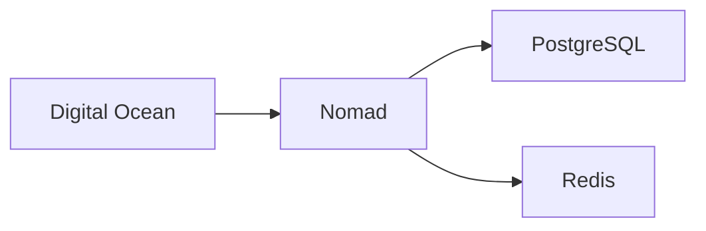

# NeoForge Infrastructure

Minimal, cost-effective infrastructure for bootstrapped founders. Start with a $10 DigitalOcean droplet, scale when needed.

## Quick Start

```bash
# Initialize Terraform
cd terraform
terraform init

# Deploy basic infrastructure
terraform apply -var-file=bootstrap.tfvars

# Deploy services
nomad job run jobs/postgres.hcl  # Deploy PostgreSQL first
nomad job run jobs/api.hcl       # Deploy API
```

## Structure

```
infra/
├── terraform/              # Infrastructure as code
│   ├── bootstrap/         # $10 droplet setup
│   ├── production/        # Full production setup
│   └── modules/          # Reusable modules
├── nomad/                 # Service orchestration
│   ├── jobs/             # Service definitions
│   │   ├── postgres.hcl  # PostgreSQL service
│   │   └── api.hcl       # API service
│   └── templates/        # Job templates
└── scripts/              # Utility scripts
```

## Bootstrap Setup ($10/month)

- Single DO droplet (1GB RAM, 1vCPU)
- Nomad + Consul
- PostgreSQL (co-hosted)
- Cloudflare (free tier)

## Database Setup

```hcl
# nomad/jobs/postgres.hcl
job "postgres" {
  datacenters = ["dc1"]
  type = "service"

  group "postgres" {
    count = 1

    volume "postgres" {
      type      = "host"
      source    = "postgres"
      read_only = false
    }

    task "postgres" {
      driver = "docker"

      config {
        image = "postgres:15-alpine"
        ports = ["postgres"]
      }

      volume_mount {
        volume      = "postgres"
        destination = "/var/lib/postgresql/data"
      }

      resources {
        cpu    = 200 # 0.2 CPU
        memory = 256 # 256MB RAM
      }

      service {
        name = "postgres"
        port = "postgres"

        check {
          type     = "tcp"
          interval = "10s"
          timeout  = "2s"
        }
      }

      template {
        data = <<EOH
          POSTGRES_USER="neoforge"
          POSTGRES_PASSWORD="{{ with secret "secret/postgres" }}{{ .Data.password }}{{ end }}"
          POSTGRES_DB="neoforge"
        EOH
        destination = "secrets/postgres.env"
        env         = true
      }
    }
  }
}
```

## Scaling Path

1. **Bootstrap** ($10/month)
   - Single droplet
   - Co-hosted PostgreSQL

2. **Growth** ($50/month)
   - Multiple droplets
   - Managed PostgreSQL

3. **Scale** ($200+/month)
   - Auto-scaling
   - Multi-region
   - HA PostgreSQL

## Key Commands

```bash
# Bootstrap deployment
make deploy-bootstrap

# Scale to production
make deploy-production

# Database operations
make db-backup     # Backup PostgreSQL
make db-restore    # Restore from backup
make db-status     # Check database status

# Status check
make status

# View logs
make logs service=api
make logs service=postgres
```

## Database Management

```bash
# Connect to PostgreSQL
nomad alloc exec -task postgres $(nomad job allocs -t postgres) psql -U neoforge

# Backup database
make db-backup

# Monitor database metrics
nomad alloc exec -task postgres $(nomad job allocs -t postgres) pg_top
```

## Learn More

- [Full Documentation](https://neoforge.dev/docs/infrastructure)
- [Scaling Guide](https://neoforge.dev/docs/scaling)
- [Cost Management](https://neoforge.dev/docs/costs)

## Security Note

Default configurations include:

- HTTPS everywhere
- Secure secrets management
- Basic DDoS protection
- Regular security updates
- Encrypted database volumes
- Automated database backups

# 🚀 Infrastructure Overview



## Scaling Path
1. Single node
2. Read replicas
3. Sharded clusters
