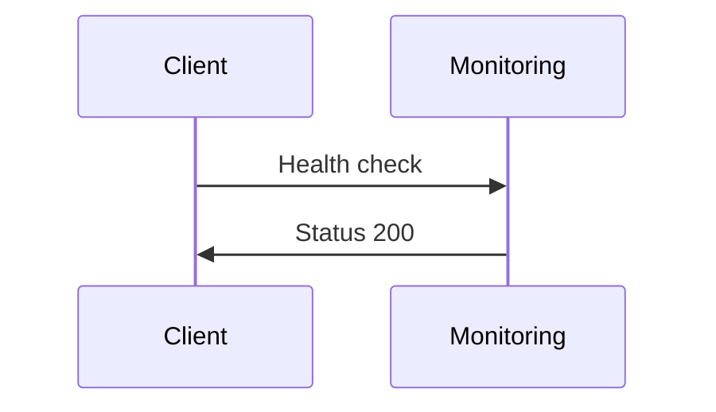

# NeoForge Monitoring Guide

## Overview

NeoForge comes with a comprehensive monitoring setup that includes:
- Structured logging with JSON output
- Prometheus metrics for system and application monitoring
- Health check endpoints for service status
- Performance monitoring with MLflow
- Email delivery tracking

## Monitoring Components

### 1. Structured Logging

All logs are JSON-formatted and include:
- Timestamp
- Log level
- Environment
- Application version
- Request details (for HTTP requests)
- Error details (when applicable)

Example log output:
```json
{
    "timestamp": "2024-02-20T10:30:45Z",
    "level": "info",
    "event": "request_processed",
    "method": "POST",
    "url": "/api/v1/users",
    "status_code": 201,
    "duration_ms": 45.2,
    "environment": "production",
    "app_version": "0.1.0"
}
```

### 2. Prometheus Metrics

Available at `/metrics`, the following metrics are tracked:

#### HTTP Metrics
- `http_request_duration_seconds` (Histogram)
  - Labels: method, endpoint
  - Tracks request duration
- `http_requests_total` (Counter)
  - Labels: method, endpoint, status
  - Counts total requests

#### Database Metrics
- `db_pool_size` (Gauge)
  - Current database connection pool size

#### Redis Metrics
- `redis_connected` (Gauge)
  - 1 if connected, 0 if disconnected

#### Email Metrics
- `emails_sent_total` (Counter)
- `emails_delivered_total` (Counter)
- `emails_failed_total` (Counter)

### 3. Health Check Endpoints

#### Basic Health Check
`GET /health`
```json
{
    "status": "healthy",
    "version": "0.1.0",
    "database_status": "healthy",
    "redis_status": "healthy"
}
```

#### Detailed Health Check
`GET /health/detailed`
```json
{
    "status": "healthy",
    "version": "0.1.0",
    "database_status": "healthy",
    "redis_status": "healthy",
    "database_latency_ms": 1.23,
    "redis_latency_ms": 0.45,
    "environment": "production"
}
```

### 4. MLflow Integration

MLflow is used for tracking:
- Model training metrics
- Model parameters
- Model artifacts
- Experiment tracking

## Monitoring Best Practices

### 1. Log Levels

- ERROR: Use for unrecoverable errors that need immediate attention
- WARNING: Use for recoverable errors or unexpected conditions
- INFO: Use for important business events and state changes
- DEBUG: Use for detailed debugging information (development only)

### 2. Performance Monitoring

Monitor these key metrics:
- Request duration (alert if p95 > 500ms)
- Database query time (alert if p95 > 100ms)
- Redis operation time (alert if p95 > 50ms)
- Error rate (alert if > 1% in 5 minutes)

### 3. Resource Monitoring

Watch for:
- Database connection pool saturation
- Redis connection status
- Memory usage
- CPU usage

### 4. Business Metrics

Track:
- Active users
- API usage by endpoint
- Error rates by endpoint
- Email delivery success rate

## Prometheus Configuration

Example Prometheus configuration:

```yaml
global:
  scrape_interval: 15s
  evaluation_interval: 15s

scrape_configs:
  - job_name: 'neoforge'
    static_configs:
      - targets: ['localhost:8000']
    metrics_path: '/metrics'
```

## Grafana Dashboards

Recommended dashboard panels:
1. System Overview
   - Request rate
   - Error rate
   - Response time percentiles
   - Active connections

2. Database Performance
   - Connection pool usage
   - Query latency
   - Active transactions

3. Email Metrics
   - Delivery rate
   - Bounce rate
   - Processing time

4. Business Metrics
   - Active users
   - API usage
   - Feature adoption

## Alert Rules

Example Prometheus alert rules:

```yaml
groups:
- name: neoforge
  rules:
  - alert: HighErrorRate
    expr: rate(http_requests_total{status=~"5.."}[5m]) / rate(http_requests_total[5m]) > 0.01
    for: 5m
    labels:
      severity: critical
    annotations:
      summary: High error rate detected

  - alert: SlowResponses
    expr: histogram_quantile(0.95, rate(http_request_duration_seconds_bucket[5m])) > 0.5
    for: 5m
    labels:
      severity: warning
    annotations:
      summary: Slow response times detected
```

## Cost Optimization

To optimize monitoring costs:
1. Adjust scrape intervals based on traffic
2. Use appropriate retention periods
3. Aggregate metrics where possible
4. Monitor storage usage

## Scaling Considerations

As your application grows:
1. Increase metric retention for longer trends
2. Add more detailed metrics
3. Set up metric aggregation
4. Implement metric federation

## Troubleshooting

Common issues and solutions:

1. High Error Rate
   - Check logs for error patterns
   - Review recent deployments
   - Check external dependencies

2. Slow Responses
   - Check database query performance
   - Review resource usage
   - Check external service latency

3. Memory Issues
   - Review memory metrics
   - Check for memory leaks
   - Adjust resource limits

## Security Considerations

1. Metrics Endpoint
   - Restrict access in production
   - Use authentication
   - Rate limit requests

2. Logging
   - Never log sensitive data
   - Mask PII in logs
   - Use appropriate log levels

## Next Steps

1. Set up Prometheus
2. Configure Grafana dashboards
3. Set up alerts
4. Monitor costs
5. Review and adjust thresholds

# 📊 Monitoring Stack



## Alert Thresholds
- Response time > 500ms
- Error rate > 1%
