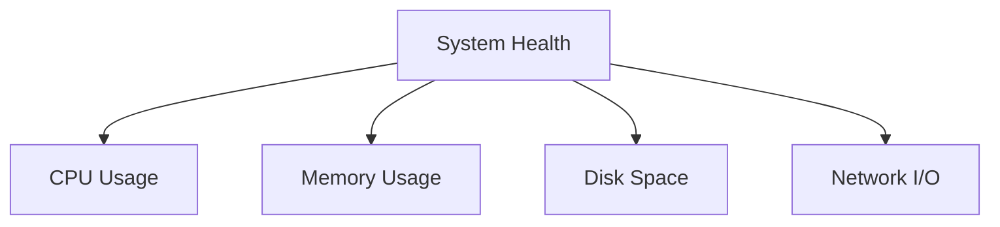
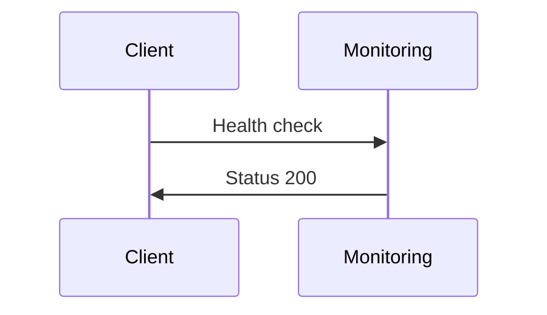

# Monitoring Guide

A practical guide to monitoring your NeoForge application with a focus on essential metrics for bootstrapped founders.

## Overview

This guide covers:

- Essential metrics to track
- Cost-effective monitoring setup
- Scaling considerations
- Alert configuration

## Core Metrics

### 1. System Health



#### Key Metrics

- CPU Usage: Alert at 70%
- Memory Usage: Alert at 80%
- Disk Space: Alert at 85%
- Network I/O: Track bandwidth usage

### 2. Application Performance

```python
# Example FastAPI middleware for performance monitoring
from fastapi import Request
import time

@app.middleware("http")
async def add_performance_metrics(request: Request, call_next):
    start_time = time.time()
    response = await call_next(request)
    duration = time.time() - start_time
    
    # Log if request takes more than 500ms
    if duration > 0.5:
        logger.warning(f"Slow request: {request.url} took {duration:.2f}s")
    
    response.headers["X-Response-Time"] = str(duration)
    return response
```

#### Key Metrics

- Response Time: < 200ms
- Error Rate: < 0.1%
- Request Rate: Track for scaling
- Database Query Time: < 100ms

### 3. Business Metrics

```typescript
// Frontend tracking example
@customElement('user-activity')
export class UserActivity extends LitElement {
    @property({ type: Number }) activeUsers = 0;

    private track() {
        this.dispatchEvent(new CustomEvent('user-action', {
            detail: { action: 'feature_used' }
        }));
    }
}
```

#### Key Metrics

- Daily Active Users
- Feature Usage
- Error Rates
- Conversion Rates

## Monitoring Setup

### 1. Basic Setup (Bootstrap Phase)

```hcl
# nomad/jobs/monitoring.hcl
job "monitoring" {
  datacenters = ["nyc3"]
  type = "service"

  group "monitoring" {
    count = 1

    task "prometheus" {
      driver = "docker"
      
      config {
        image = "prom/prometheus:latest"
        ports = ["prometheus"]
      }

      resources {
        cpu    = 100  # 0.1 CPU
        memory = 256  # 256MB RAM
      }
    }
  }
}
```

### 2. Prometheus Configuration

```yaml
# prometheus.yml
global:
  scrape_interval: 30s  # Reduced frequency for cost saving

scrape_configs:
  - job_name: 'api'
    static_configs:
      - targets: ['localhost:8000']
    metrics_path: '/metrics'
```

### 3. Logging Setup

```python
# logging_config.py
import structlog

def setup_logging():
    structlog.configure(
        processors=[
            structlog.processors.TimeStamper(fmt="iso"),
            structlog.processors.JSONRenderer()
        ],
        wrapper_class=structlog.BoundLogger,
        context_class=dict,
        logger_factory=structlog.PrintLoggerFactory(),
    )
```

## Cost-Effective Alert Strategy

### 1. Essential Alerts

```yaml
# alerts.yml
groups:
- name: essential
  rules:
  - alert: HighCPUUsage
    expr: cpu_usage_percent > 70
    for: 5m
    labels:
      severity: warning
    annotations:
      summary: High CPU usage detected

  - alert: LowDiskSpace
    expr: disk_free_percent < 15
    for: 5m
    labels:
      severity: warning
```

### 2. Business Alerts

```python
# business_metrics.py
async def monitor_business_metrics():
    daily_users = await get_daily_active_users()
    if daily_users > settings.SCALE_THRESHOLD:
        notify_admin("Scale threshold reached")
```

## Dashboard Setup

### 1. Basic Grafana Setup

```hcl
job "grafana" {
  group "monitoring" {
    task "grafana" {
      driver = "docker"
      
      config {
        image = "grafana/grafana:latest"
      }

      resources {
        cpu    = 100
        memory = 128
      }
    }
  }
}
```

### 2. Essential Dashboards

- System Overview
  - CPU, Memory, Disk Usage
  - Network I/O
- Application Performance
  - Response Times
  - Error Rates
  - Request Rates
- Business Metrics
  - User Activity
  - Feature Usage
  - Conversion Rates

## Scaling Monitoring

### 1. When to Scale Monitoring

- More than 1000 daily active users
- Response times consistently > 200ms
- Error rates > 0.1%
- CPU usage consistently > 70%

### 2. Enhanced Monitoring Setup

```yaml
# Advanced Prometheus config
global:
  scrape_interval: 15s
  evaluation_interval: 15s

rule_files:
  - "alerts/*.yml"

scrape_configs:
  - job_name: 'api'
    static_configs:
      - targets: ['api:8000']
  - job_name: 'node'
    static_configs:
      - targets: ['node-exporter:9100']
```

## Best Practices

1. **Start Small**
   - Begin with essential metrics
   - Use lightweight monitoring
   - Focus on actionable alerts

2. **Cost Control**
   - Reduce scrape frequency
   - Limit retention period
   - Use aggregation

3. **Alert Strategy**
   - Alert on actionable items
   - Reduce alert noise
   - Define clear escalation paths

4. **Data Retention**
   - Keep raw data for 7 days
   - Aggregate older data
   - Archive important metrics

## Troubleshooting Guide

### Common Issues

1. **High CPU Usage**

   ```bash
   # Check top processes
   nomad alloc exec <alloc-id> top
   ```

2. **Memory Leaks**

   ```bash
   # Check memory usage
   nomad alloc exec <alloc-id> free -m
   ```

3. **Disk Space**

   ```bash
   # Check disk usage
   nomad alloc exec <alloc-id> df -h
   ```

## Next Steps

1. **Basic Setup**
   - Install Prometheus
   - Configure basic metrics
   - Set up essential alerts

2. **Enhanced Monitoring**
   - Add business metrics
   - Configure dashboards
   - Set up alert notifications

3. **Scale Monitoring**
   - Add more metrics
   - Increase retention
   - Add redundancy

Remember:

1. Start with essentials
2. Monitor costs
3. Alert only on actionable items
4. Scale gradually
5. Keep it simple

# 📊 Monitoring Stack



## Alert Thresholds
- Response time > 500ms
- Error rate > 1%
