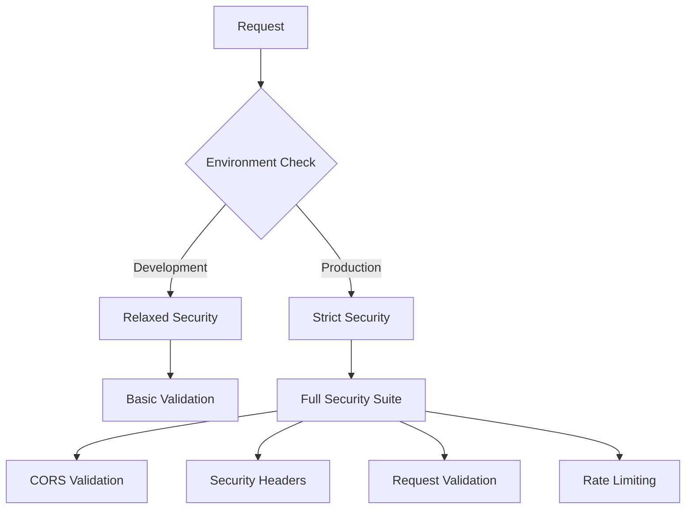

# 🔒 NeoForge Security Guide

**Comprehensive security hardening for production deployment**

## Overview

NeoForge implements a multi-layered security architecture designed to protect against common web application vulnerabilities while maintaining development convenience. Security configurations automatically adapt based on the `ENVIRONMENT` setting.

## Security Architecture

### 1. Environment-Based Security



### 2. Security Layers

| Layer | Development | Production | Purpose |
|-------|------------|------------|---------|
| **CORS** | Localhost allowed | HTTPS only | Cross-origin protection |
| **Headers** | Basic CSP | Strict CSP + HSTS | Browser security |
| **Validation** | Minimal | Full threat detection | Input sanitization |
| **Rate Limiting** | Lenient | Strict | DoS protection |

## Configuration

### Environment Variables

#### Development Settings
```bash
ENVIRONMENT=development
DEBUG=true
CORS_ORIGINS=["http://localhost:3000", "http://localhost:8000"]
CORS_METHODS=["*"]
CORS_HEADERS=["*"]
RATE_LIMIT_REQUESTS=1000
RATE_LIMIT_WINDOW=60
```

#### Production Settings
```bash
ENVIRONMENT=production
DEBUG=false
CORS_ORIGINS=["https://yourdomain.com"]
CORS_METHODS=["GET", "POST", "PUT", "DELETE", "OPTIONS"]
CORS_HEADERS=["Content-Type", "Authorization", "Accept"]
RATE_LIMIT_REQUESTS=100
RATE_LIMIT_WINDOW=60
```

### Secrets Management

#### Development Secrets (insecure, for local development only)
```bash
SECRET_KEY=dev_secret_key_replace_in_production_7e1a34bd93b148f0
JWT_SECRET_KEY=dev_jwt_secret_key_replace_in_production_7e1a34bd93b148f0
```

#### Production Secrets (CRITICAL - must be changed)
```bash
SECRET_KEY=your-super-secure-32-character-secret-key
JWT_SECRET_KEY=your-jwt-secret-at-least-32-characters-long
```

**⚠️ SECURITY WARNING**: Never use development secrets in production!

## Security Features

### 1. CORS Protection

#### Development Configuration
- Allows `http://localhost` origins
- Permits all methods and headers
- Enables credentials for local development

#### Production Configuration
- **HTTPS Only**: Blocks all HTTP origins
- **Domain Restriction**: Only specified domains allowed
- **Method Limitation**: Restricted to necessary HTTP methods
- **Header Control**: Limited to essential headers

```python
# Automatic production validation
if environment == "production":
    if "*" in cors_origins:
        raise ValueError("Wildcard CORS origins not allowed in production")
    for origin in cors_origins:
        if not origin.startswith("https://"):
            raise ValueError("Production requires HTTPS origins")
```

### 2. Security Headers

#### Production Headers Applied
```http
Strict-Transport-Security: max-age=31536000; includeSubDomains; preload
X-Content-Type-Options: nosniff
X-Frame-Options: DENY
X-XSS-Protection: 1; mode=block
Content-Security-Policy: default-src 'self'; script-src 'self'; ...
Permissions-Policy: accelerometer=(), camera=(), geolocation=()...
Cross-Origin-Embedder-Policy: require-corp
Cross-Origin-Opener-Policy: same-origin
Cross-Origin-Resource-Policy: same-site
```

#### Development Headers (Relaxed)
- Allows `unsafe-inline` and `unsafe-eval` for dev tools
- Permits `http:` connections
- Enables WebSocket connections for hot-reload

### 3. Request Validation & Threat Detection

#### Security Validations Applied

**Path-based Attacks**
```python
SUSPICIOUS_PATHS = [
    "/.env", "/config", "/admin", "/wp-admin", 
    "/.git", "/backup", "/db", "/database"
]
```

**SQL Injection Detection**
```python
SQL_INJECTION_PATTERNS = [
    r"('|(\\')|(;)|(--)|(\s(or|and)\s+.*(=|like))",
    r"(union\s+select|drop\s+table|insert\s+into)",
    r"(exec\s*\(|sp_executesql|xp_cmdshell)"
]
```

**XSS Attack Detection**
```python
XSS_PATTERNS = [
    r"<script[^>]*>.*?</script>",
    r"javascript:",
    r"on\w+\s*=",
    r"<iframe[^>]*>.*?</iframe>"
]
```

**Malicious User-Agent Blocking**
```python
BLOCKED_USER_AGENTS = [
    "sqlmap", "nikto", "nmap", "masscan", 
    "gobuster", "dirb", "dirbuster", "wfuzz"
]
```

### 4. Rate Limiting

#### Configuration
```python
# In-memory rate limiting (development)
# Redis-based rate limiting (production recommended)
RATE_LIMIT_REQUESTS=100  # requests per window
RATE_LIMIT_WINDOW=60     # window in seconds
```

#### Per-Client IP Tracking
- Extracts real IP from proxy headers (`X-Forwarded-For`, `X-Real-IP`)
- Maintains request history per IP
- Automatic cleanup of expired entries

#### Response Headers
```http
# On rate limit exceeded
HTTP/1.1 429 Too Many Requests
Retry-After: 60
Content-Type: application/json

{"detail": "Rate limit exceeded"}
```

## Production Deployment Checklist

### 🔒 Security Essentials

- [ ] **Environment**: Set `ENVIRONMENT=production`
- [ ] **Secrets**: Generate new 32+ character secrets
- [ ] **CORS**: Configure only your production domains
- [ ] **HTTPS**: All origins must use HTTPS
- [ ] **Database**: Use production database with restricted access
- [ ] **Rate Limiting**: Set appropriate limits for your use case

### 🌐 Network Security

- [ ] **Reverse Proxy**: Use Nginx or similar
- [ ] **Firewall**: Restrict unnecessary ports
- [ ] **SSL/TLS**: Implement proper certificates
- [ ] **DNS**: Configure proper DNS settings

### 📊 Monitoring & Logging

- [ ] **Security Logs**: Monitor for blocked requests
- [ ] **Rate Limit Alerts**: Alert on repeated violations
- [ ] **Failed Auth Attempts**: Monitor authentication failures
- [ ] **Suspicious Activity**: Track unusual patterns

## Security Testing

### 1. CORS Testing

```bash
# Test production CORS restrictions
curl -X OPTIONS \
  -H "Origin: http://malicious.com" \
  -H "Access-Control-Request-Method: POST" \
  -H "Access-Control-Request-Headers: Content-Type" \
  https://yourapi.com/api/v1/users

# Should return 403 or CORS error
```

### 2. Security Header Testing

```bash
# Check security headers
curl -I https://yourapi.com/health

# Expected headers:
# Strict-Transport-Security: max-age=31536000; includeSubDomains; preload
# X-Content-Type-Options: nosniff
# X-Frame-Options: DENY
```

### 3. Rate Limiting Testing

```bash
# Test rate limiting
for i in {1..110}; do
  curl -s https://yourapi.com/health > /dev/null
  echo "Request $i"
done

# Should get 429 after configured limit
```

### 4. Input Validation Testing

```bash
# Test SQL injection detection (should be blocked)
curl -X POST https://yourapi.com/api/v1/users \
  -H "Content-Type: application/json" \
  -d '{"email": "test@test.com OR 1=1--"}'

# Should return 400 with "Invalid request data"
```

## Security Monitoring

### Key Metrics to Monitor

1. **Blocked Requests**: Count of security violations
2. **Rate Limit Violations**: Frequency and sources
3. **Failed Authentication**: Repeated failures by IP
4. **Suspicious User-Agents**: Automated tool detection

### Log Examples

```json
{
  "event": "security_threat_detected",
  "threats": ["Potential SQL injection detected"],
  "client_ip": "192.168.1.100",
  "path": "/api/v1/users",
  "method": "POST",
  "timestamp": "2024-01-01T10:00:00Z"
}
```

```json
{
  "event": "rate_limit_exceeded",
  "client_ip": "192.168.1.100",
  "path": "/api/v1/data",
  "method": "GET",
  "timestamp": "2024-01-01T10:00:00Z"
}
```

## Advanced Security

### 1. Redis-Based Rate Limiting

For production, implement Redis-based rate limiting:

```python
# Example Redis rate limiting implementation
import redis.asyncio as aioredis

class RedisRateLimiter:
    def __init__(self, redis_url: str):
        self.redis = aioredis.from_url(redis_url)
    
    async def is_rate_limited(self, key: str, limit: int, window: int) -> bool:
        current = await self.redis.get(key)
        if current is None:
            await self.redis.setex(key, window, 1)
            return False
        elif int(current) < limit:
            await self.redis.incr(key)
            return False
        return True
```

### 2. WAF Integration

Consider integrating with a Web Application Firewall:
- **Cloudflare WAF**: Built-in protection
- **AWS WAF**: Advanced rule sets
- **Custom Rules**: Application-specific protection

### 3. Security Headers Testing

Use security testing tools:
```bash
# Security headers analysis
curl -I https://yourapi.com | grep -E "(X-|Strict|Content-Security)"

# Or use online tools:
# - securityheaders.com
# - observatory.mozilla.org
```

## Troubleshooting

### Common Issues

#### CORS Errors in Production
```bash
# Symptom: "Access-Control-Allow-Origin" errors
# Solution: Verify CORS_ORIGINS includes your frontend domain
CORS_ORIGINS=["https://yourfrontend.com"]
```

#### Rate Limiting False Positives
```bash
# Symptom: Legitimate users getting 429 errors
# Solution: Increase rate limits or implement user-based limits
RATE_LIMIT_REQUESTS=1000  # Increase limit
```

#### CSP Violations
```bash
# Symptom: Resources blocked by Content Security Policy
# Solution: Add necessary domains to CSP whitelist
# Check browser console for CSP violation reports
```

### Security Incident Response

1. **Immediate Actions**:
   - Review security logs
   - Block malicious IPs at firewall level
   - Increase monitoring temporarily

2. **Investigation**:
   - Analyze attack patterns
   - Check for data exposure
   - Review authentication logs

3. **Recovery**:
   - Update security rules
   - Rotate secrets if compromised
   - Implement additional protections

## Security Updates

### Regular Maintenance

- **Weekly**: Review security logs and metrics
- **Monthly**: Update dependencies for security patches
- **Quarterly**: Security audit and penetration testing
- **Yearly**: Full security architecture review

### Staying Current

- Monitor CVE databases for vulnerabilities
- Subscribe to security advisories for FastAPI, dependencies
- Keep rate limiting and validation rules updated
- Review and update CSP policies as needed

---

**Remember**: Security is a process, not a destination. Regular monitoring, testing, and updates are essential for maintaining a secure application.