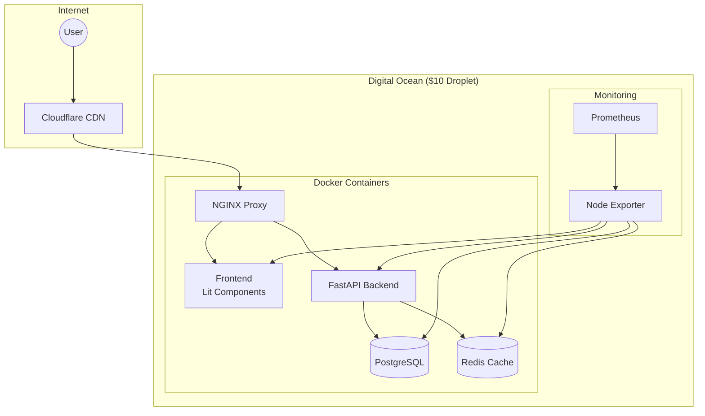
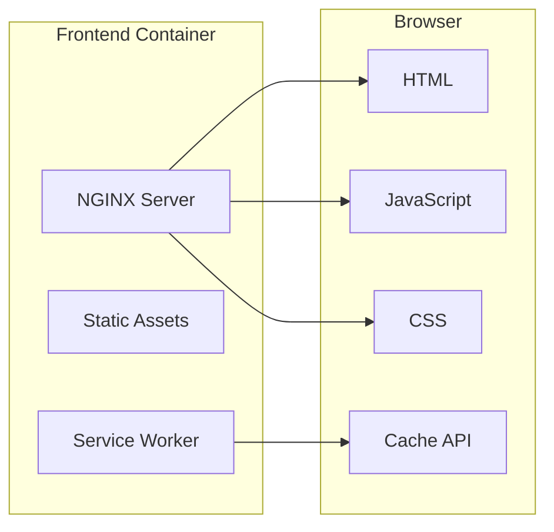
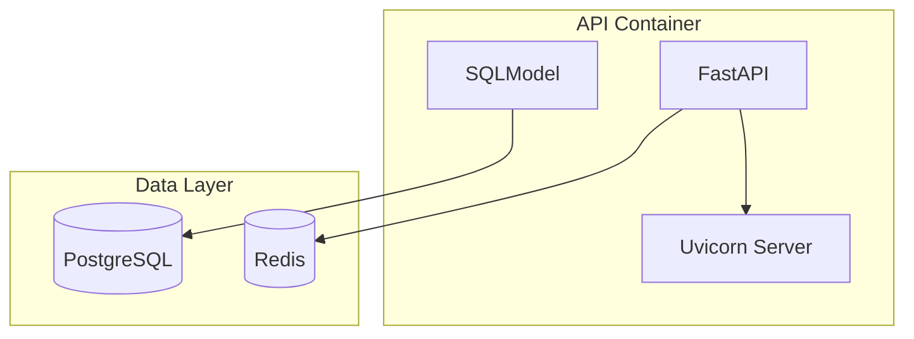
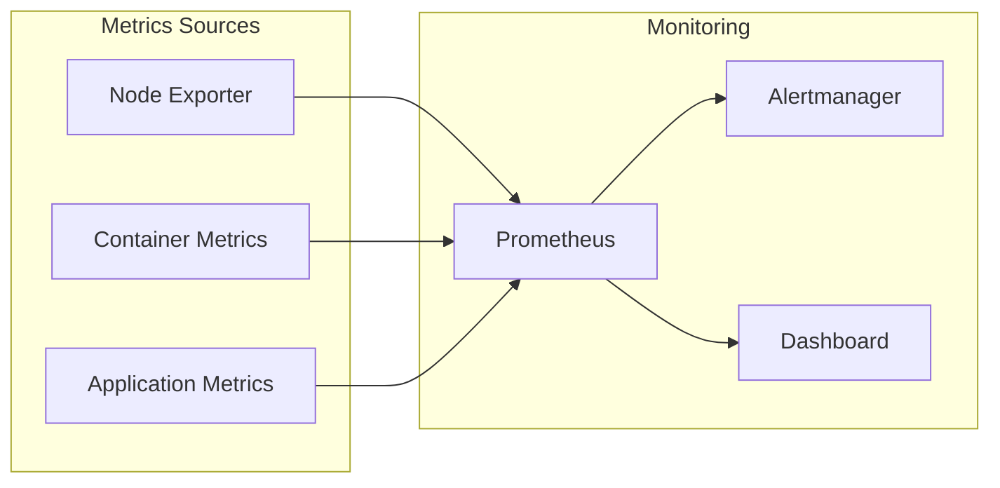
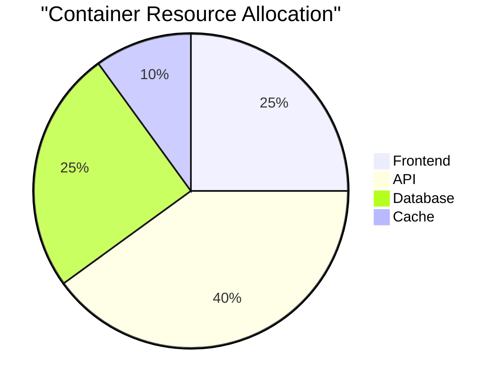
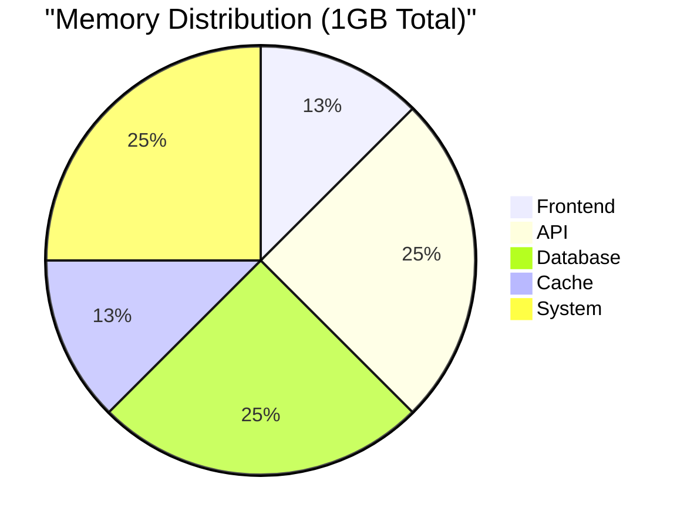
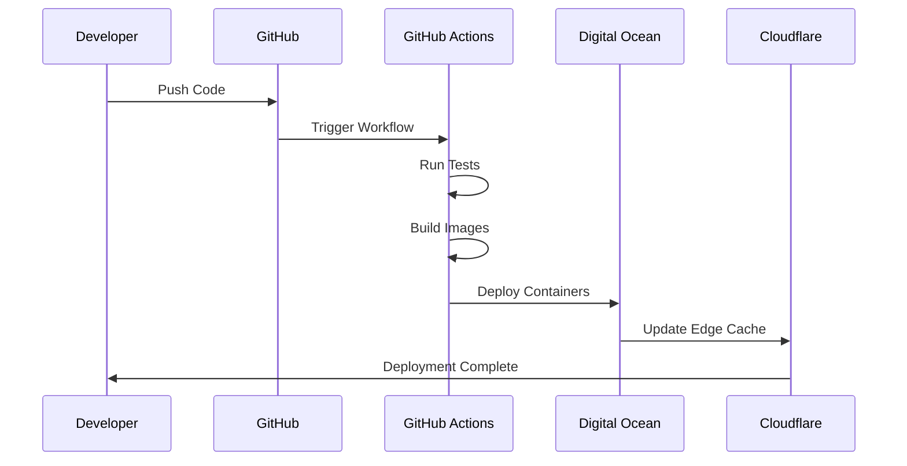
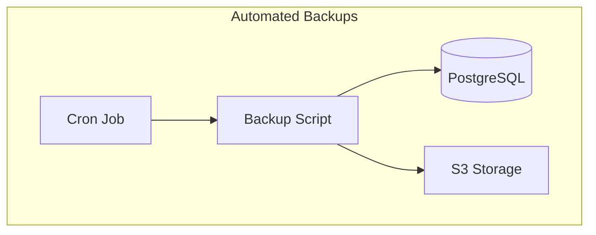
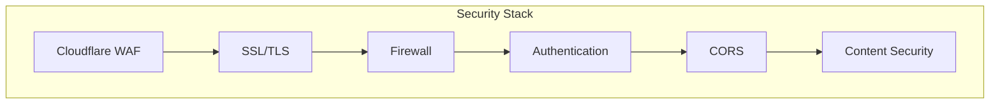

# Infrastructure Architecture

## Overview

NeoForge uses a containerized microservices architecture deployed on a single Digital Ocean droplet, with Cloudflare CDN for edge caching and distribution.

## Architecture Diagram

## Component Details

### Frontend Layer

### API Layer

### Monitoring Stack

## Resource Allocation

### Container Resources

### Memory Distribution

## Deployment Flow

## Backup Strategy

## Security Layers

