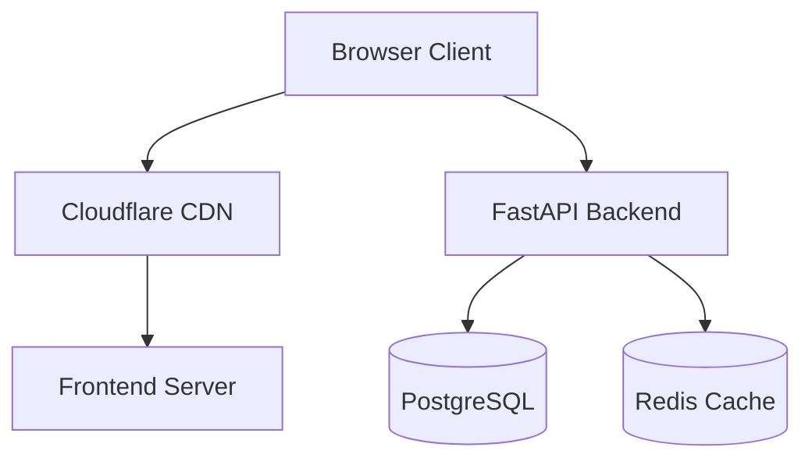
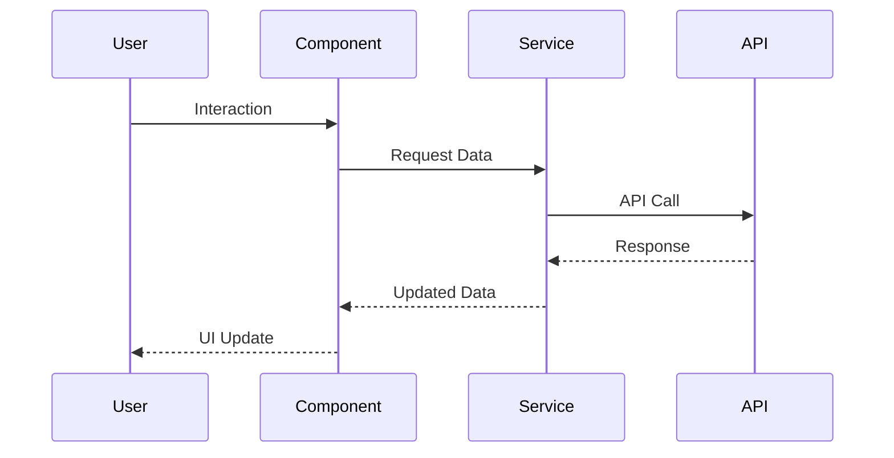
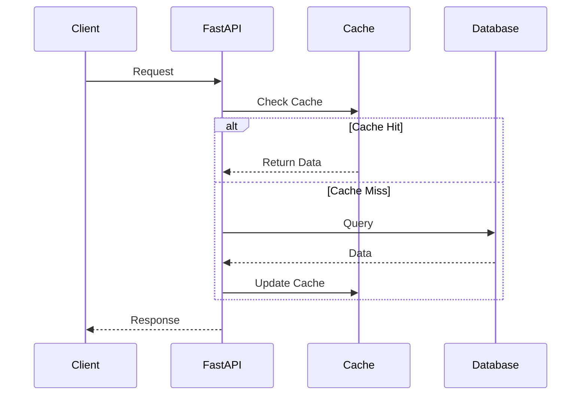
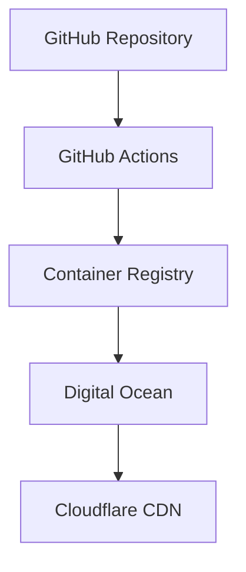

# Architecture Guide

NeoForge follows a modern, scalable architecture designed for performance and maintainability. This guide explains our core architectural decisions and patterns.

## System Overview

## Core Components

### Frontend Architecture

- **Web Components**: Built with Lit for native browser support
- **No Build Tools**: Zero-config development environment
- **PWA Support**: Service workers for offline functionality
- **State Management**: Simple, reactive data flow

### Backend Architecture

- **FastAPI**: Modern, high-performance Python web framework
- **SQLModel**: Type-safe database interactions
- **Redis Cache**: High-speed data caching
- **Docker**: Containerized services

## Design Principles

1. **Simplicity First**
   - Minimal dependencies
   - Native browser features
   - Clear separation of concerns

2. **Performance Focused**
   - Optimized bundle sizes
   - Efficient caching strategies
   - Lazy loading patterns

3. **Developer Experience**
   - Hot module reloading
   - Type safety
   - Clear documentation
   - Automated testing

4. **Production Ready**
   - Scalable infrastructure
   - Monitoring built-in
   - Security best practices

## Data Flow

### Frontend Data Flow

### Backend Data Flow

## Security Architecture

1. **Authentication**
   - JWT-based token system
   - Secure password hashing
   - Email verification
   - OAuth support

2. **Authorization**
   - Role-based access control
   - Resource-level permissions
   - API rate limiting

3. **Data Protection**
   - HTTPS everywhere
   - CORS configuration
   - Input validation
   - SQL injection prevention

## Deployment Architecture

## Performance Optimization

1. **Frontend Performance**
   - Code splitting
   - Tree shaking
   - Asset optimization
   - Caching strategies

2. **Backend Performance**
   - Database indexing
   - Query optimization
   - Connection pooling
   - Caching layers

## Monitoring and Observability

1. **Metrics Collection**
   - Application metrics
   - System metrics
   - User metrics
   - Business metrics

2. **Logging**
   - Structured logging
   - Error tracking
   - Audit trails
   - Performance monitoring

## Next Steps

- Review our [Component Guide](./components)
- Learn about [State Management](./state-management)
- Understand [API Design](./api-design)
- Explore [Testing Strategies](./testing) 