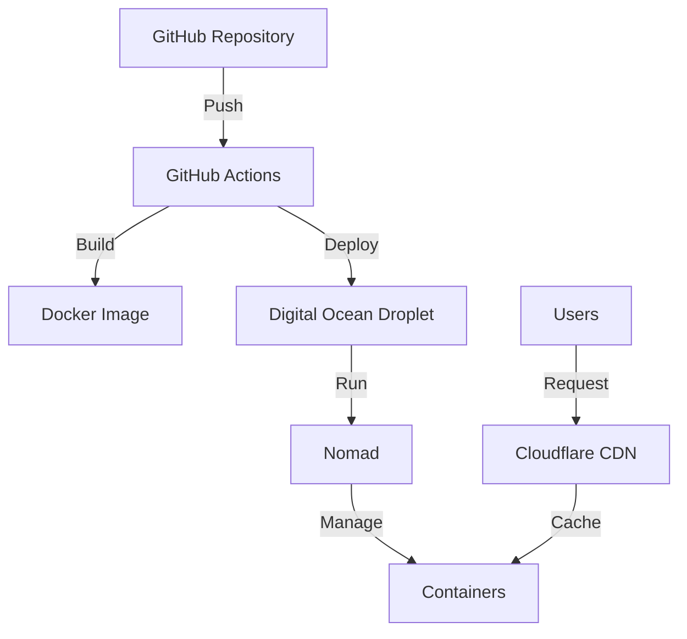

# Deployment Guide

This guide covers the deployment process for NeoForge using Docker and Nomad on a Digital Ocean droplet, with Cloudflare CDN integration.

## Prerequisites

- Docker installed on your local machine
- Access to a Digital Ocean account
- A registered domain name
- Cloudflare account
- GitHub account for CI/CD

## Infrastructure Overview



## Step-by-Step Deployment

### 1. Initial Setup

```bash
# Clone the repository
git clone https://github.com/your-org/neoforge.git
cd neoforge

# Build the Docker image
docker build -t neoforge-frontend .
```

### 2. Digital Ocean Setup

1. Create a new droplet:
   - Size: Basic ($10/month)
   - Region: Choose nearest to your users
   - Image: Ubuntu 22.04 LTS
   - SSH Key: Add your public key

2. Configure firewall:
```bash
ufw allow 80/tcp
ufw allow 443/tcp
ufw allow 22/tcp
ufw enable
```

### 3. Nomad Configuration

Create a Nomad job specification:

```hcl
job "neoforge-frontend" {
  datacenters = ["dc1"]
  type = "service"

  group "frontend" {
    count = 1

    network {
      port "http" {
        to = 80
      }
    }

    task "server" {
      driver = "docker"

      config {
        image = "neoforge-frontend:latest"
        ports = ["http"]
      }

      resources {
        cpu    = 500
        memory = 256
      }

      service {
        name = "frontend"
        port = "http"
        
        check {
          type     = "http"
          path     = "/"
          interval = "10s"
          timeout  = "2s"
        }
      }
    }
  }
}
```

### 4. GitHub Actions Workflow

Create `.github/workflows/deploy.yml`:

```yaml
name: Deploy Frontend

on:
  push:
    branches: [ main ]

jobs:
  deploy:
    runs-on: ubuntu-latest
    steps:
      - uses: actions/checkout@v3
      
      - name: Set up Docker Buildx
        uses: docker/setup-buildx-action@v2
      
      - name: Login to Docker Hub
        uses: docker/login-action@v2
        with:
          username: ${{ secrets.DOCKER_HUB_USERNAME }}
          password: ${{ secrets.DOCKER_HUB_TOKEN }}
      
      - name: Build and push
        uses: docker/build-push-action@v4
        with:
          push: true
          tags: your-org/neoforge-frontend:latest
      
      - name: Deploy to Digital Ocean
        uses: appleboy/ssh-action@master
        with:
          host: ${{ secrets.DROPLET_IP }}
          username: ${{ secrets.DROPLET_USER }}
          key: ${{ secrets.SSH_PRIVATE_KEY }}
          script: |
            nomad job run neoforge-frontend.nomad
```

### 5. Cloudflare Setup

1. Add your domain to Cloudflare
2. Update nameservers with your domain registrar
3. Configure SSL/TLS:
   - Set to Full (strict)
   - Enable HTTPS redirect
4. Configure Page Rules:
   ```
   URL: example.com/*
   Settings:
   - Cache Level: Cache Everything
   - Edge Cache TTL: 4 hours
   ```

### 6. Environment Variables

Create a `.env` file:

```env
VITE_API_URL=https://api.example.com
VITE_ENVIRONMENT=production
VITE_ANALYTICS_ID=UA-XXXXXXXX-X
```

### 7. Performance Optimization

1. Enable Brotli compression:
```nginx
brotli on;
brotli_comp_level 6;
brotli_types text/plain text/css application/javascript application/json image/svg+xml;
```

2. Configure caching headers:
```nginx
location /assets/ {
    expires 1y;
    add_header Cache-Control "public, no-transform";
}
```

### 8. Monitoring Setup

1. Set up health checks:
```javascript
// health.js
app.get('/health', (req, res) => {
  res.status(200).json({
    status: 'healthy',
    timestamp: new Date().toISOString()
  });
});
```

2. Configure monitoring endpoints:
```yaml
endpoints:
  - /health
  - /metrics
  - /ready
```

## Rollback Procedure

If deployment fails:

```bash
# Revert to previous version
nomad job revert neoforge-frontend

# Check status
nomad job status neoforge-frontend
```

## Troubleshooting

### Common Issues

1. **Container fails to start**
   ```bash
   # Check logs
   nomad alloc logs <alloc-id>
   ```

2. **SSL Certificate Issues**
   - Verify Cloudflare SSL mode
   - Check origin certificate
   - Validate DNS propagation

3. **Performance Issues**
   - Check Cloudflare Analytics
   - Verify caching headers
   - Monitor resource usage

## Security Considerations

1. **SSL/TLS Configuration**
   - Enable HSTS
   - Use secure ciphers
   - Enable TLS 1.3

2. **Docker Security**
   - Use non-root user
   - Implement resource limits
   - Regular security updates

3. **Access Control**
   - Implement rate limiting
   - Use secure headers
   - Configure CORS properly

## Maintenance

### Regular Tasks

1. **Weekly**
   - Check error rates
   - Review performance metrics
   - Update dependencies

2. **Monthly**
   - Security patches
   - SSL certificate check
   - Backup verification

3. **Quarterly**
   - Load testing
   - Disaster recovery test
   - Infrastructure review

## Support

For deployment issues:
- Create a GitHub issue
- Contact: support@example.com
- Emergency: ops@example.com

## References

- [Docker Documentation](https://docs.docker.com/)
- [Nomad Documentation](https://www.nomadproject.io/docs)
- [Cloudflare Documentation](https://developers.cloudflare.com/) 